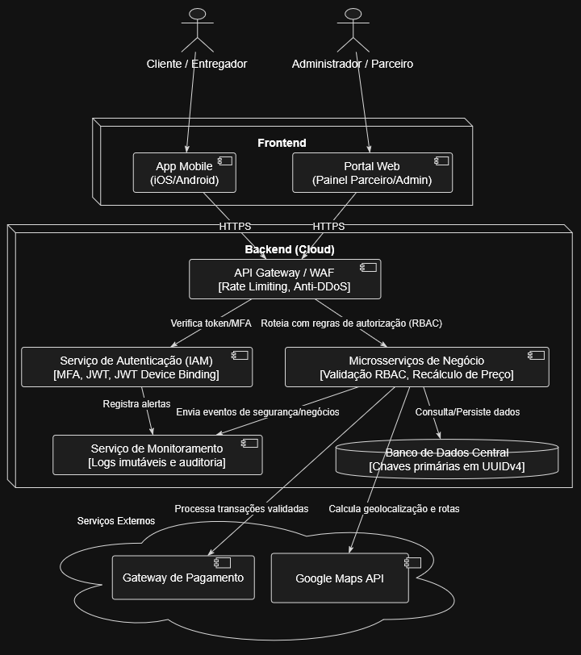

# Etapa 3 — Projeto de uma Arquitetura Segura

## 3.1 Requisitos de Segurança

Os três requisitos abaixo foram derivados diretamente dos riscos prioritários identificados na Etapa 2 (R04, R06 e R02), selecionados por representarem as vulnerabilidades de maior impacto estrutural e regulatório no sistema.

| ID | Risco relacionado | Requisito de segurança | Critério de verificação |
| :---: | :---: | :--- | :--- |
| **RS-01** | R04 — Extração em Massa por IDOR | O sistema deve garantir que nenhum endpoint da API retorne dados de um recurso (perfil, pedido, endereço) sem verificar explicitamente se o usuário autenticado possui autorização sobre aquele objeto específico. Identificadores de recursos devem ser UUIDs v4 não sequenciais em todos os endpoints públicos e internos. | Execução de teste automatizado (DAST) tentando acessar recursos de outros usuários com token válido próprio — 100% das tentativas devem retornar HTTP 403. Nenhum endpoint deve aceitar IDs numéricos sequenciais em produção. |
| **RS-02** | R06 — Broken Access Control no Painel Admin | O sistema deve implementar controle de acesso baseado em papéis (RBAC) verificado no servidor para todas as rotas administrativas (`/admin/*`), rejeitando qualquer requisição cujo token JWT não contenha explicitamente a *claim* de papel Administrador, independentemente do que for exibido ou ocultado na interface. | Teste automatizado no pipeline de CI/CD verificando que tokens com papel `restaurant` ou `customer` recebem HTTP 403 em todas as rotas `/admin/*`. Revisão de código obrigatória para qualquer alteração em endpoints administrativos. |
| **RS-03** | R02 — Manipulação do Valor do Pedido | O sistema deve recalcular obrigatoriamente o valor total de todo pedido no servidor com base nos preços registrados no banco de dados, ignorando qualquer valor monetário enviado pelo cliente na requisição. O payload do carrinho deve ser assinado com HMAC antes do envio e verificado no servidor antes do processamento. | Testes unitários cobrindo 100% dos cenários de divergência de valor entre cliente e servidor — nenhum pedido com valor adulterado deve ser aprovado. Zero transações com divergência de valor em produção por 30 dias consecutivos após a implementação. |

---

## 3.2 Vulnerabilidades Catalogadas

As três vulnerabilidades abaixo foram identificadas na OWASP e CWE como correspondentes diretas aos requisitos de segurança definidos na seção anterior, mapeando as fraquezas técnicas que os requisitos visam eliminar.

| Risco | Vulnerabilidade | Referência utilizada | Relação com o sistema |
| :---: | :--- | :---: | :--- |
| **R04 / RS-01** | **IDOR — Insecure Direct Object Reference** (Referência Direta Insegura a Objetos): ocorre quando o sistema expõe referências a objetos internos (IDs de banco de dados, nomes de arquivos) sem verificar se o usuário autenticado possui autorização sobre aquele objeto específico. Um atacante com acesso legítimo ao sistema pode manipular essas referências para acessar recursos de outros usuários. | OWASP Top 10 2021 — **A01: Broken Access Control**; CWE-639: Authorization Bypass Through User-Controlled Key | No sistema de delivery, endpoints como `GET /api/profile/{id}` e `GET /api/orders/{id}` utilizam IDs sequenciais previsíveis sem validar se o usuário autenticado é o titular do recurso solicitado. Isso permite que um atacante enumere e extraia CPFs, endereços e histórico de compras de toda a base de usuários de forma automatizada, configurando o risco R04. |
| **R06 / RS-02** | **Broken Access Control** (Controle de Acesso Quebrado): categoria ampla que engloba falhas onde usuários conseguem agir fora de suas permissões previstas, incluindo acesso a funcionalidades ou dados de outros usuários, acesso não autorizado a painéis administrativos e elevação de privilégio por manipulação de parâmetros ou tokens. | OWASP Top 10 2021 — **A01: Broken Access Control**; CWE-285: Improper Authorization; CWE-862: Missing Authorization | No sistema de delivery, os endpoints do painel administrativo (`/api/admin/*`) verificam apenas se o usuário está autenticado (possui um token JWT válido), sem verificar se o token contém a *claim* de papel Administrador. Um operador de restaurante com token válido consegue replicar chamadas administrativas e manipular comissões e configurações globais da plataforma, configurando o risco R06. |
| **R02 / RS-03** | **Mass Assignment / Client-Side Parameter Tampering** (Atribuição em Massa e Adulteração de Parâmetros pelo Cliente): ocorre quando a aplicação confia em dados enviados pelo cliente para processar operações críticas sem revalidação no servidor. No contexto de e-commerce e delivery, manifesta-se quando valores financeiros calculados no frontend são enviados na requisição e processados sem verificação contra o valor correto no banco de dados. | OWASP Top 10 2021 — **A04: Insecure Design**; CWE-915: Improperly Controlled Modification of Dynamically-Determined Object Attributes; OWASP Cheat Sheet: Mass Assignment | No sistema de delivery, a API de checkout processa o campo `total_amount` enviado pelo cliente na requisição `POST /checkout` sem recalcular o valor com base nos preços do catálogo no banco de dados. Um cliente com proxy HTTP consegue alterar esse campo para R$ 0,00 e ter o pedido processado sem cobrança, configurando o risco R02. |

## 3.3 Diagrama da Arquitetura Segura

O diagrama abaixo ilustra a arquitetura da solução, destacando onde os principais controles de segurança estão posicionados para tratar os riscos mapeados (WAF, MFA, controle de acesso RBAC, Logs de Auditoria e UUIDs no banco de dados).

## 3.4 Decisões de Arquitetura
Com base nos riscos prioritários levantados na Etapa 2, definimos três decisões fundamentais de arquitetura para garantir que o sistema seja seguro desde a sua concepção técnica.

| Decisão | Risco mitigado | Justificativa (Motivo, Componente e Resultado Esperado) |
| :--- | :---: | :--- |
| **Adoção de UUIDs versão 4 para chaves primárias** | **R04** (Extração em Massa de Dados por IDOR) | **Motivo:** Impedir que um atacante consiga enumerar e extrair dados de outros usuários apenas incrementando números sequenciais (ex: `/api/user/1` para `/api/user/2`).  **Componente afetado:** Banco de Dados e endpoints da API.  **Resultado esperado:** Impossibilidade técnica de varredura e adivinhação de rotas, eliminando a falha de design que permitia o vazamento em massa de dados. |
| **Validação de Autorização Centralizada via API Gateway / Middleware com RBAC** | **R06** (Broken Access Control no Painel Admin) | **Motivo:** Ocultar opções na interface front-end não impede ataques diretos aos endpoints; a verificação precisa garantir que o token JWT contenha a declaração explícita (claim) do papel de Administrador.  **Componente afetado:** API Gateway / Gestão de Identidade (IAM).  **Resultado esperado:** Qualquer requisição para a rota `/admin/*` feita por parceiros ou clientes é rejeitada imediatamente com erro `HTTP 403 Forbidden` antes de atingir os microsserviços internos. |
| **Processamento Transacional estritamente *Server-Side* com recálculo de valores** | **R02** (Manipulação do Valor do Pedido) | **Motivo:** O aplicativo mobile e o front-end web não são ambientes confiáveis, e parâmetros enviados pelo cliente podem ser interceptados e modificados via proxy (ex: zerando o valor do carrinho).  **Componente afetado:** API de Checkout e Gateway de Pagamento.  **Resultado esperado:** O backend ignora valores monetários enviados pelo cliente e sempre recalcula o total do pedido consultando o banco de dados interno, rejeitando compras fraudadas e mitigando prejuízos. |

## 3.5 Decisões de Arquitetura

Com base nos riscos prioritários levantados na Etapa 2, definimos três decisões fundamentais de arquitetura para garantir que o sistema seja seguro desde a sua concepção técnica.

| Decisão | Risco mitigado | Justificativa (Motivo, Componente e Resultado Esperado) |
| :--- | :---: | :--- |
| **Adoção de UUIDs versão 4 para chaves primárias** | **R04** (Extração em Massa de Dados por IDOR) | **Motivo:** Impedir que um atacante consiga enumerar e extrair dados de outros usuários apenas incrementando números sequenciais (ex: `/api/user/1` para `/api/user/2`).  **Componente afetado:** Banco de Dados e endpoints da API.  **Resultado esperado:** Impossibilidade técnica de varredura e adivinhação de rotas, eliminando a falha de design que permitia o vazamento em massa de dados. |
| **Validação de Autorização Centralizada via API Gateway / Middleware com RBAC** | **R06** (Broken Access Control no Painel Admin) | **Motivo:** Ocultar opções na interface front-end não impede ataques diretos aos endpoints; a verificação precisa garantir que o token JWT contenha a declaração explícita (claim) do papel de Administrador.  **Componente afetado:** API Gateway / Gestão de Identidade (IAM).  **Resultado esperado:** Qualquer requisição para a rota `/admin/*` feita por parceiros ou clientes é rejeitada imediatamente com erro `HTTP 403 Forbidden` antes de atingir os microsserviços internos. |
| **Processamento Transacional estritamente *Server-Side* com recálculo de valores** | **R02** (Manipulação do Valor do Pedido) | **Motivo:** O aplicativo mobile e o front-end web não são ambientes confiáveis, e parâmetros enviados pelo cliente podem ser interceptados e modificados via proxy (ex: zerando o valor do carrinho).  **Componente afetado:** API de Checkout e Gateway de Pagamento.  **Resultado esperado:** O backend ignora valores monetários enviados pelo cliente e sempre recalcula o total do pedido consultando o banco de dados interno, rejeitando compras fraudadas e mitigando prejuízos. |

### Considerações Finais — Etapa 3

A Etapa 3 traduziu os riscos quantificados na Etapa 2 em decisões concretas de arquitetura segura, estabelecendo a fundação técnica sobre a qual os controles das etapas seguintes serão implementados.

Os três requisitos de segurança definidos (RS-01, RS-02 e RS-03) derivam diretamente dos riscos de maior impacto estrutural identificados — R04 (IDOR), R06 (Broken Access Control) e R02 (Tampering de valor) — garantindo rastreabilidade direta entre a análise de risco e as decisões de projeto. As três decisões de arquitetura correspondentes (UUIDs v4, RBAC centralizado no API Gateway e recálculo server-side) compartilham uma característica importante: todas eliminam a condição habilitadora do risco por design, em vez de apenas mitigar seus efeitos após a exploração.

O diagrama da arquitetura segura evidencia que os controles não foram distribuídos aleatoriamente pelos componentes, mas posicionados nas fronteiras críticas do sistema — o API Gateway como ponto único de verificação de autorização, o backend como único responsável pelo cálculo de valores financeiros e o banco de dados como camada onde os identificadores sequenciais são substituídos por UUIDs não previsíveis.

A principal limitação desta etapa é que as decisões de arquitetura foram validadas conceitualmente, mas ainda não foram submetidas a testes de segurança em ambiente de execução. Essa validação ocorrerá na Etapa 5, com a execução do OWASP ZAP sobre a aplicação implementada. Os requisitos RS-01, RS-02 e RS-03 definidos aqui servirão como critérios de aceite para os testes das Etapas 4 e 5.

