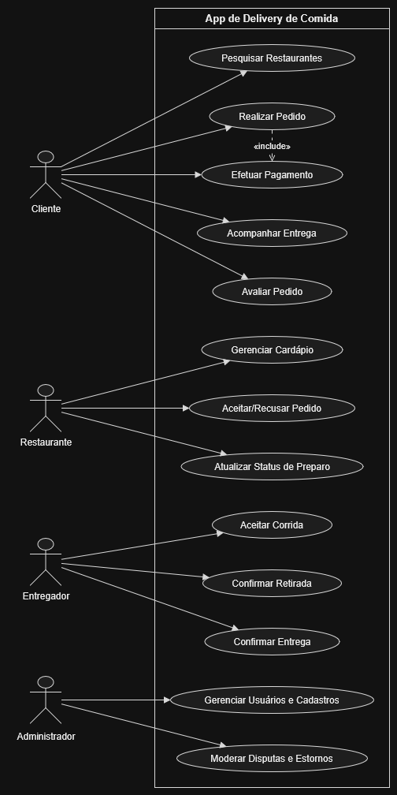

# Documento Principal de Modelagem de Ameaças e Análise de Riscos — ESS

> **Disciplina:** Engenharia de Software Seguro — Codefólio  
> **Sistema Analisado:** App de Delivery de Comida *(Plataforma Integrada de Pedidos e Entregas Online)*

---

## 8.1 Identificação do Sistema

* **Nome do Sistema:** App de Delivery de Comida *(Plataforma Integrada de Pedidos e Entregas Online)*
* **Endereço do Repositório:** [https://github.com/gabrieldm-arch/Grupo-2-ES-Seguro](https://github.com/gabrieldm-arch/Grupo-2-ES-Seguro)
* **Integrantes do Grupo:**
  * **Gabriel Martinez**
  * **Kaique Schio**
  * **Pedro Ayres**

### Justificativa para a Escolha do Sistema
O ecossistema de um aplicativo de entrega de comida foi selecionado por ser um ambiente computacional amplamente distribuído e crucial do ponto de vista da segurança da informação. Os principais motivos que nos levam a escolher são:
1. **Múltiplos perfis e níveis de privilégio:** A plataforma conecta ao mesmo tempo Clientes, que são os consumidores finais, Restaurantes/Estabelecimentos, Entregadores e Administradores, o que demanda um controle estrito de autenticação e divisão de privilégios.
2. **Ativos críticos e dados sensíveis:** Armazenamento e circulação de dados pessoais, como CPF, endereço residencial, números de telefone, dados bancários/cartões de crédito, histórico de pedidos e rastreamento de geolocalização em tempo real, em conformidade com a LGPD.
3. **Operações financeiras e vulnerabilidade à fraude:** Transações constantes por meio de PIX, cartões e carteiras digitais, além de procedimentos de estorno, cupons de desconto e transferências de pagamento, que costumam ser alvos de fraudes por agentes mal-intencionados.
4. **Superfície de ataque ampliada:** Integração abrangente com APIs externas, gateways de pagamento, serviços de geolocalização, como o maps, e sistemas de mensagem/notificação, possibilitando a aplicação de todas as categorias de ameaças da metodologia **STRIDE**.

---

## 8.2 Descrição do Sistema

O **App de Delivery de Comida** é uma plataforma distribuída constituída por aplicativos móveis (Android/iOS), portal web para estabelecimentos e painel administrativo, interligados via serviços de API backend.

### 1. Qual problema o sistema resolve
O sistema resolve o problema de intermediação eficiente e em tempo real entre o **setor de alimentação**, **consumidores** e **entregadores independentes**. Ele consolida em uma única plataforma:
* A digitalização de cardápios e recebimento automatizado de pedidos para os restaurantes.
* A facilidade de descoberta, pagamento digital e acompanhamento logístico para os clientes.
* A distribuição otimizada de rotas de entrega e repasses financeiros para os entregadores parceiros.

### 2. Quem utiliza o sistema (Atores e Perfis de Acesso)
* **Clientes (Consumidores):** Usuários que buscam restaurantes, realizam pedidos, efetuam pagamentos digitais, utilizam cupons promocionais e acompanham a geolocalização do pedido até a entrega.
* **Restaurantes / Estabelecimentos Parceiros:** Operadores que utilizam o portal parceiro para cadastrar itens, definir preços, gerenciar estoque, aceitar/recusar pedidos e visualizar relatórios de repasses financeiros.
* **Entregadores (Parceiros Logísticos):** Usuários móveis que recebem chamadas de corrida, visualizam endereços de coleta e entrega, confirmam retiradas com códigos de segurança e comunicam-se via chat restrito com clientes e restaurantes.
* **Administradores da Plataforma:** Equipe técnica e operacional com poderes elevados para gestão de cadastros, aprovação de estabelecimentos/entregadores, moderação de disputas (estornos, denúncias), parametrização de comissões e auditoria do sistema.

### 3. Quais são as principais funcionalidades
* **Gestão de Identidade e Acesso (IAM):** Cadastro e autenticação de usuários, autenticação multifator (MFA/TOTP) para operações sensíveis, recuperação de credenciais e gestão de perfis em conformidade com a LGPD.
* **Catálogo Georreferenciado e Pedidos:** Busca de estabelecimentos próximos com base nas coordenadas GPS, personalização do pedido, cálculo automático de frete e gestão do carrinho de compras.
* **Gateway e Processamento de Pagamentos:** Cobrança via cartões de crédito/débito, PIX e saldo em carteira digital, com aplicação de regras de antifraude, validação de cupons promocionais e processamento do repasse aos parceiros.
* **Logística e Rastreamento em Tempo Real:** Roteamento e despacho de entregadores, acompanhamento GPS ao vivo da coleta à entrega e validação de conclusão de entrega via código OTP.
* **Mensageria e Notificações:** Sistema de chat integrado entre Cliente-Entregador e Cliente-Restaurante (com mascaramento de telefone para proteção da privacidade) e envio de notificações push/SMS sobre o status do pedido.

### 4. Quais informações são armazenadas ou transmitidas
* **Dados Pessoais Sensíveis e Cadastrais (LGPD):** Nome completo, CPF, e-mail, telefone, endereço residencial/entrega e data de nascimento.
* **Dados Financeiros e de Faturamento:** Tokens vinculados a cartões bancários (via gateway PCI-DSS), chaves PIX, histórico de pedidos, cupons aplicados, extratos de repasse e notas fiscais.
* **Dados Geolocalizados:** Histórico de rotas e coordenadas GPS precisas e contínuas de entregadores em serviço e endereços de destino de clientes.
* **Dados Operacionais e de Auditoria:** Logs de requisições às APIs, registros de chat entre usuários, avaliações/reviews de lojas e entregadores e históricos de cancelamento/estorno.

### 5. Quais recursos precisam ser protegidos
Para subsidiar a modelagem de ameaças e mitigação de abusos, destacam-se os principais ativos de segurança da plataforma:
* **Banco de Dados Central (PII e Pedidos):** Base que armazena todas as informações pessoais dos clientes, parceiros e histórico transacional; alvo principal para ataques de vazamento de informações (*Information Disclosure*).
* **APIs de Checkout e Gateway de Pagamento:** Endpoints de cobrança, aplicação de cupons e repasse financeiro que devem ser imunes a manipulação de preços ou autorizações indevidas (*Tampering / Elevation of Privilege*).
* **Sessões e Tokens de Autenticação (JWT/OAuth2):** Chaves de acesso e tokens de sessão que garantem a autenticação e autorização de cada usuário sem permitir sequestro de contas (*Spoofing*).
* **Serviço de Comunicação e Roteamento GPS:** Mecanismos que garantem a disponibilidade logística e impedem rastreamento indevido ou interceptação de conversas privadas entre clientes e parceiros.
* **Servidores e Infraestrutura de Backend:** Ambiente de execução de microserviços, filas de mensagens e balanceadores de carga, que precisam estar protegidos contra ataques de negação de serviço (*Denial of Service - DoS*).

---

## 8.3 Usuários, ativos e pontos de interação

O sistema de Delivery interliga dezenas de componentes. Abaixo estão mapeados os principais elementos e recursos do ecossistema, segmentados por categoria:

### Usuários e Perfis de Acesso
- **Cliente:** O consumidor final, com acesso via App Mobile e Web.
- **Parceiro (Restaurante):** O operador do estabelecimento, com acesso via Portal Web do Parceiro.
- **Entregador:** O parceiro logístico motorizado/ciclista, com acesso via App Mobile do Entregador.
- **Administrador:** O integrante do suporte/gestão da plataforma, com acesso via Painel Admin Web.

### Credenciais e Autenticação
- Senhas com hash criptográfico, tokens temporários (OTP/PIN via SMS e E-mail).
- Tokens de sessão (JWT) e tokens OAuth2 para logins sociais (Google/Apple).

### Pagamentos e Financeiro
- Dados bancários, cartões de crédito (acessíveis à plataforma apenas de forma tokenizada pelo Gateway parceiro).
- Chaves PIX, histórico de compras, carteiras digitais (cashback/saldo) e registros de repasses/comissões.

### Localização, Mensagens e Avaliações
- **GPS:** Histórico e coordenadas em tempo real (posição do entregador e endereço exato de residência do cliente).
- **Chat:** Sistema de mensageria interna para dúvidas sobre o pedido e contato direto (com mascaramento de números).
- **Reviews:** Avaliações de qualidade, fotos de recebimentos e comentários sobre a conduta de entregadores/lojas.

### Arquitetura: Servidores, Bancos de Dados e Aplicações
- **Aplicações (Front-end):** Aplicativos nativos iOS/Android (Clientes e Entregadores) e SPAs Web (Painéis de Restaurantes/Admin).
- **Servidores (Back-end):** Servidores Cloud em provedor de nuvem, APIs de Backend (microsserviços REST/GraphQL), balanceadores de carga e filas de mensagens para processamento assíncrono (RabbitMQ/Kafka).
- **Banco de Dados:** Bancos relacionais (ex.: PostgreSQL para transações, pedidos e controle de saldos) e não-relacionais (ex.: MongoDB para logs, histórico de chat e avaliações).

### Serviços Externos e APIs
- **APIs de Pagamento:** Conexões externas para processamento de cobranças e estornos (ex.: Stripe, MercadoPago, Pagar.me).
- **APIs de Mapeamento:** Conexões para cálculo de rota e distância (ex.: Google Maps, Mapbox).
- **APIs de Comunicação:** Serviços de envio de e-mails, SMS e Push Notifications (ex.: Twilio, Firebase, SendGrid).

### Ativos Críticos Destacados
Os recursos que podem causar os maiores prejuízos, como financeiros, regulatórios, legais ou de reputação, caso sejam acessados, alterados, destruídos ou indisponibilizados indevidamente são:

1. **Bancos de Dados de Pagamentos e PII (Informações Pessoalmente Identificáveis):**
   * Contém CPFs, endereços, perfis comportamentais e saldos. Uma falha de segurança levaria a multas milionárias da LGPD e destruição da confiança da base de clientes.
2. **APIs e Gateway de Pagamentos:**
   * Se um atacante forjar requisições ou se passar por um restaurante, pode drenar fundos, aprovar pedidos sem pagar ou alterar as contas de repasse.
3. **Serviços de Roteamento (GPS) e Chat Privado:**
   * A interceptação em tempo real do GPS ou das conversas pode colocar em risco a segurança física dos usuários, como entregadores e clientes, em caso de perseguições, assaltos ou golpes no momento da entrega.
4. **Infraestrutura Cloud de Microsserviços e Filas de Mensagens:**
   * A indisponibilidade da nuvem ou interrupção no despacho de pedidos por algumas poucas horas, especialmente em horários de pico, como finais de semana, gera um prejuízo direto no faturamento.

---

## 8.4 Visão Geral da Arquitetura

Para ilustrar as interações no sistema, elaboramos um **Diagrama de Casos de Uso**, que mapeia as principais ações realizadas pelos quatro atores fundamentais da plataforma: **Cliente**, **Restaurante**, **Entregador** e **Administrador**.

### Documentação Descritiva do Diagrama
O diagrama representa a fronteira do sistema de Delivery e as interações diretas de cada perfil de usuário:
* **Cliente:** Interage com a vitrine do aplicativo, onde pode pesquisar restaurantes, realizar pedidos, efetuar pagamentos e acompanhar a rota da entrega em tempo real.
* **Restaurante (Parceiro):** Focado na operação do estabelecimento. Gerencia seu cardápio, aceita ou recusa os pedidos recebidos e atualiza o status de preparo para notificar o cliente e o entregador.
* **Entregador:** Focado na logística. Recebe e aceita chamados de corrida, confirma a retirada no restaurante e, finalmente, confirma a entrega no endereço do cliente.
* **Administrador:** Possui visão gerencial de retaguarda. É responsável por gerenciar os cadastros (aprovar restaurantes e entregadores) e moderar disputas (como pedidos não entregues ou solicitações de estorno).

## 8.5 Modelagem STRIDE

A tabela a seguir apresenta a análise de ameaças utilizando a metodologia STRIDE. Cada categoria foi mapeada com foco estrito nas operações, ativos críticos e perfis de acesso (clientes, restaurantes, entregadores e administradores) presentes no ecossistema da plataforma de delivery.

| Categoria STRIDE | Descrição da Ameaça | Ativo/Ponto de Interação Afetado | Cenário de Ataque (Casos de Abuso no Delivery) | Impacto Principal |
| :--- | :--- | :--- | :--- | :--- |
| **Spoofing** | Um ator malicioso assume a identidade de um usuário legítimo (cliente, entregador ou restaurante). | Sessões e Tokens de Autenticação (JWT/OAuth2). | Um atacante consegue roubar o token de sessão de um entregador e utiliza seu perfil no aplicativo para aceitar corridas com o único intuito de furtar as refeições coletadas nos restaurantes. | Roubo de mercadorias, risco à segurança física dos clientes e dano severo à reputação da plataforma. |
| **Tampering** | Alteração indevida de dados em trânsito ou informações armazenadas no sistema. | APIs de Checkout e Gateway de Pagamento. | Um cliente mal-intencionado intercepta a requisição HTTP de finalização do pedido e altera o parâmetro do valor final para R$ 0,00 antes de enviá-la para a API de cobrança. | Fraude financeira direta, perda de receita para a plataforma e falha no repasse aos restaurantes parceiros. |
| **Repudiation** | Um usuário nega ter realizado uma ação (ex: compra, entrega) e o sistema não possui logs/provas suficientes para contestá-lo. | App do Entregador, Logs de Auditoria. | Um cliente recebe seu pedido corretamente, mas entra em contato com o suporte afirmando que o entregador nunca apareceu, exigindo o estorno do valor (golpe do estorno/chargeback). | Prejuízos financeiros para a plataforma ou restaurante, além de possível banimento injusto do parceiro logístico. |
| **Information Disclosure** | Exposição ou vazamento de dados sensíveis e pessoais a agentes não autorizados. | Banco de Dados Central (PII e Pedidos), Serviços de Roteamento (GPS). | Uma vulnerabilidade no banco de dados central (IDOR) permite que um atacante extraia em massa CPFs, endereços residenciais e o histórico de coordenadas de entregas. | Multas milionárias por infração à LGPD, exposição física dos usuários e quebra total de confiança. |
| **Denial of Service** | Sobrecarga de recursos que torna o sistema indisponível para usuários legítimos. | Servidores e Infraestrutura de Backend, Filas de Mensagens. | Uma *botnet* inunda as APIs de catálogo de restaurantes e roteamento com milhares de requisições simultâneas durante um horário de pico (ex: sexta-feira à noite). | Indisponibilidade total do aplicativo, impedindo novos pedidos e gerando prejuízo massivo no faturamento diário. |
| **Elevation of Privilege** | Um usuário comum obtém permissões de acesso superiores às do seu perfil (ex: administrador). | Painel Admin Web, Gestão de Identidade (IAM). | Um perfil de restaurante explora uma falha de autorização (Broken Access Control) no portal web e consegue acessar endpoints exclusivos da equipe de Administração, alterando a própria taxa de comissão para 0%. | Comprometimento sistêmico, fraudes internas em larga escala e manipulação das regras de negócio do delivery. |

## 8.6 Casos de Abuso

| ID | Caso de Abuso | Categoria STRIDE | Ativo/Ponto de Interação Afetado | Ator Malicioso | Pré-condição | Fluxo do Abuso | Impacto | Contramedidas |
| :--- | :--- | :--- | :--- | :--- | :--- | :--- | :--- | :--- |
| **CA-01** | Sequestro de Sessão de Entregador | Spoofing | Sessões e Tokens de Autenticação (JWT/OAuth2) | Atacante externo | Atacante obteve o token JWT de um entregador ativo via phishing, sniffing em rede insegura ou malware no dispositivo móvel | Atacante captura o token JWT do entregador → configura o token no cabeçalho Authorization → autentica-se na API do app do entregador → aceita corridas e coleta pedidos nos restaurantes → pedidos nunca são entregues ao cliente | Roubo de mercadorias, risco à segurança física dos clientes e dano severo à reputação da plataforma | Vincular o token JWT ao `device_id` e IP de origem; tokens de curta expiração (15 min) com refresh token rotativo; MFA/TOTP obrigatório no login do entregador; alerta de sessão simultânea em outro dispositivo |
| **CA-02** | Manipulação do Valor de Pedido na Requisição | Tampering | APIs de Checkout e Gateway de Pagamento | Cliente mal-intencionado | Cliente utiliza proxy HTTP (ex.: Burp Suite, mitmproxy) para interceptar o tráfego entre o app mobile e a API de backend | Cliente intercepta a requisição `POST /checkout` → altera o campo `total_amount` de R$ 89,90 para R$ 0,00 → envia a requisição modificada ao servidor → backend aprova o pedido sem cobrança → restaurante prepara e entregador leva sem que o pagamento ocorra | Fraude financeira direta, perda de receita para a plataforma e falha no repasse aos restaurantes parceiros | Backend sempre recalcula o total com base nos preços do banco de dados; assinatura HMAC do payload do carrinho; rejeitar transação se valor recebido divergir do valor calculado no servidor |
| **CA-03** | Golpe do Estorno por Falsa Não-Entrega | Repudiation | App do Entregador, Logs de Auditoria | Cliente desonesto | Sistema não registra provas irrefutáveis da conclusão da entrega (OTP, foto, log de geolocalização com timestamp) | Entregador conclui a entrega → cliente recebe o pedido mas não confirma no app → cliente abre chamado alegando não-entrega → plataforma, sem provas sólidas, defere o estorno → entregador e/ou restaurante arcam com o prejuízo → cliente repete o golpe em pedidos futuros | Prejuízos financeiros recorrentes para a plataforma e restaurantes; banimento injusto de entregadores honestos | Código OTP de confirmação de entrega validado no ato da entrega; registro de geolocalização com timestamp ao marcar "entregue"; foto obrigatória da entrega armazenada em log imutável; análise de comportamento para clientes com histórico de estornos frequentes |
| **CA-04** | Extração em Massa de Dados Pessoais por IDOR | Information Disclosure | Banco de Dados Central (PII e Pedidos), Serviços de Roteamento (GPS) | Atacante externo | Existência de vulnerabilidade IDOR em endpoints da API que retornam dados de usuários por identificadores sequenciais ou previsíveis | Atacante cria conta legítima → observa sua requisição `GET /api/profile/10432` → itera sobre IDs vizinhos → recebe dados de outros usuários → automatiza a extração em massa → exfiltra CPFs, endereços, GPS e histórico de compras | Multas milionárias por infração à LGPD, exposição física dos usuários e quebra total de confiança | Autorização baseada em objeto (verificar se o usuário tem permissão sobre o recurso solicitado); uso de UUIDs não sequenciais; rate limiting nos endpoints de perfil; alertas automáticos para requisições a múltiplos IDs distintos em curto intervalo |
| **CA-05** | DDoS por Botnet em Horário de Pico | Denial of Service | Servidores e Infraestrutura de Backend, Filas de Mensagens | Atacante externo (operador de botnet) | Plataforma sem rate limiting robusto, WAF ou proteção anti-DDoS nos endpoints públicos | Atacante agenda ataque para horário de pico → botnet envia ~50.000 req/s aos endpoints `/search` e `/catalog` → servidores atingem limite de capacidade → filas de mensagens acumulam backlog inprocessável → plataforma fica indisponível | Indisponibilidade total do aplicativo, impedindo novos pedidos e gerando prejuízo massivo no faturamento diário | Rate limiting por IP e por usuário; WAF com detecção de tráfego anômalo; proteção anti-DDoS na infraestrutura (ex.: Cloudflare, AWS Shield); auto-scaling; circuit breaker nas filas de mensagens |
| **CA-06** | Escalonamento de Privilégio via Broken Access Control | Elevation of Privilege | Painel Admin Web, Gestão de Identidade (IAM) | Operador de restaurante mal-intencionado | Endpoints administrativos protegidos apenas por autenticação, sem verificação de autorização por papel (role) | Operador autentica-se no portal parceiro → inspeciona chamadas de rede → identifica `PATCH /api/admin/commissions/998` → replica a requisição com seu próprio token JWT → backend valida apenas a autenticação, não o role → comissão é zerada | Comprometimento sistêmico, fraudes financeiras em larga escala e manipulação das regras de negócio do delivery | RBAC: verificar explicitamente o papel do usuário em todo endpoint; princípio do menor privilégio; tokens de parceiros e administradores com escopos distintos no JWT; testes SAST/DAST cobrindo escalonamento de privilégio |

## 8.7 Considerações Finais — Etapa 1

Esta seção sintetiza os principais resultados da análise de segurança realizada na Etapa 1, consolidando as ameaças mais preocupantes, os ativos de maior valor, os casos de abuso de maior impacto potencial e as principais dificuldades encontradas pelo grupo durante o processo de análise.

---

### Ameaças mais preocupantes

A aplicação do STRIDE ao ecossistema de delivery revelou um conjunto de ameaças que, pelo seu potencial de dano combinado e pela facilidade relativa de exploração, merecem atenção prioritária:

**Information Disclosure — Extração em Massa por IDOR (T07 / CA-04)**
A ameaça de exposição de dados pessoais por meio de vulnerabilidade IDOR nos endpoints da API é considerada a mais crítica do ponto de vista regulatório e de impacto social. O sistema armazena CPF, endereço residencial, histórico de geolocalização e dados financeiros de potencialmente milhões de usuários. Uma única vulnerabilidade de controle de acesso em nível de objeto pode permitir a extração automatizada de toda essa base, resultando em sanções administrativas da ANPD, ações judiciais coletivas e destruição irreversível da confiança dos usuários. O agravante é que esse tipo de vulnerabilidade frequentemente passa despercebido em testes convencionais, exigindo testes específicos de autorização por objeto.

**Spoofing — Sequestro de Sessão de Entregador (T01 / CA-01)**
O comprometimento da conta de um entregador ativo representa uma ameaça multidimensional: além do impacto financeiro imediato com o desvio de pedidos, coloca em risco a segurança física dos clientes que aguardam a entrega e dos entregadores legítimos que são penalizados indevidamente. A ausência de MFA obrigatório e de vinculação do token JWT ao dispositivo de origem são condições que tornam essa ameaça particularmente explorável com técnicas de baixo custo, como phishing direcionado.

**Elevation of Privilege — Broken Access Control no Painel Administrativo (T12 / CA-06)**
A possibilidade de um operador de restaurante acessar endpoints administrativos por falha de verificação de papel (*role*) representa uma ameaça sistêmica. Diferente de ataques externos, essa exploração é realizada com credenciais legítimas, tornando-a mais difícil de detectar. O impacto vai além do caso específico de zeragem de comissão: um atacante com acesso ao painel administrativo pode manipular regras de negócio, acessar dados de todos os parceiros e comprometer a integridade financeira da plataforma.

**Tampering — Manipulação do Valor do Pedido (T03 / CA-02)**
A adulteração de parâmetros financeiros em requisições HTTP decorre de um erro de design recorrente em sistemas de e-commerce: delegar ao cliente a responsabilidade de informar o valor correto da transação. Embora a mitigação seja tecnicamente simples (recálculo obrigatório no servidor), o impacto enquanto a vulnerabilidade existir é financeiro e direto, afetando simultaneamente a plataforma e os restaurantes parceiros.

---

### Ativos mais importantes

A análise identificou quatro ativos cuja proteção é considerada essencial para a viabilidade operacional, financeira e legal da plataforma:

**1. Banco de Dados Central (PII e Pedidos)**
É o ativo de maior criticidade do sistema. Concentra CPFs, endereços, histórico de consumo, coordenadas de geolocalização e dados comportamentais de todos os usuários. Seu comprometimento implica consequências regulatórias (LGPD/ANPD), financeiras (multas e indenizações) e reputacionais de difícil reversão. Qualquer ameaça que resulte em acesso não autorizado a este banco deve ser tratada como crítica, independentemente do vetor de ataque utilizado.

**2. APIs de Checkout e Gateway de Pagamento**
Representam o núcleo financeiro da plataforma. Falhas nesses endpoints impactam diretamente a receita da plataforma, o repasse aos restaurantes parceiros e a confiança dos clientes nas transações. A integridade dessas APIs é condição necessária para a operação sustentável do negócio.

**3. Sessões e Tokens de Autenticação (JWT/OAuth2)**
O controle de acesso de toda a plataforma depende da integridade desses tokens. O comprometimento de um token de qualquer perfil — especialmente administrador ou restaurante — pode dar a um atacante acesso a funcionalidades e dados muito além do previsto para aquela identidade. A gestão adequada do ciclo de vida dos tokens (expiração curta, rotação, vinculação ao dispositivo) é um controle fundamental e transversal a todas as categorias do STRIDE.

**4. Infraestrutura de Backend e Filas de Mensagens**
A disponibilidade do serviço em horários de pico é um requisito de negócio crítico. A indisponibilidade da infraestrutura por algumas horas em um final de semana representa prejuízo direto no faturamento, perda de clientes para concorrentes e dano à reputação da plataforma. Este ativo é o alvo primário das ameaças de Denial of Service identificadas (T10, T11 / CA-05).

---

### Casos de abuso de maior impacto potencial

Considerando a combinação de facilidade de exploração, escala do dano e dificuldade de detecção:

| Posição | Caso de Abuso | Ameaças relacionadas | Motivo do destaque |
| :---: | :--- | :---: | :--- |
| 1º | **CA-04** — Extração em Massa por IDOR | T07 | Impacto regulatório e social massivo; exploração automatizável; difícil detecção sem monitoramento específico |
| 2º | **CA-06** — Broken Access Control no Painel Admin | T12 | Comprometimento sistêmico das regras de negócio; realizado com credenciais legítimas; impacto financeiro em larga escala |
| 3º | **CA-05** — DDoS por Botnet em Horário de Pico | T10, T11 | Impacto operacional imediato e visível; afeta todos os usuários simultaneamente; custo de ataque baixo para o atacante |
| 4º | **CA-01** — Sequestro de Sessão de Entregador | T01 | Impacto multidimensional (financeiro, físico e reputacional); explora vetor humano amplamente disponível (phishing) |
| 5º | **CA-02** — Manipulação do Valor do Pedido | T03 | Prejuízo financeiro direto e recorrente; exploração de erro de design frequente; escalável para múltiplos atacantes |
| 6º | **CA-03** — Golpe do Estorno por Falsa Não-Entrega | T05 | Impacto financeiro recorrente e dano a entregadores legítimos; difícil de combater sem evidências sólidas de entrega |

---

### Principais dificuldades encontradas

**Delimitação do escopo da análise**
Um sistema de delivery real é composto por dezenas de microsserviços, integrações externas e fluxos de dados complexos. Definir o nível de granularidade adequado — suficientemente detalhado para ser útil, mas sem tornar o documento excessivamente extenso — exigiu diversas revisões e decisões de escopo ao longo da análise.

**Diferenciação entre ameaça, vulnerabilidade e caso de abuso**
No início da análise, o grupo teve dificuldade em distinguir com clareza o que constitui uma ameaça (o que pode acontecer), uma vulnerabilidade (a condição que permite que aconteça) e um caso de abuso (a narrativa de como um atacante exploraria essa condição na prática). A estruturação iterativa do documento, com revisões cruzadas entre as seções 8.5 e 8.6, foi necessária para garantir a coerência entre essas camadas.

**Estimativa de impacto sem dados reais**
Como o sistema analisado é hipotético, a avaliação de impacto das ameaças precisou ser baseada em referências do setor e analogias com incidentes reais em plataformas similares, sem acesso a métricas concretas de faturamento, base de usuários ou histórico de incidentes. Isso introduz uma margem de subjetividade que precisará ser revisada em etapas futuras com dados mais concretos.

**Cobertura equilibrada de todas as categorias do STRIDE**
Algumas categorias, como Repudiation e Elevation of Privilege, são menos intuitivas do que Spoofing ou Denial of Service no contexto de delivery. Garantir que todas as seis categorias recebessem ameaças concretas e contextualizadas — e não apenas definições genéricas — demandou esforço adicional de pesquisa e revisão entre os integrantes do grupo.

---

### Síntese geral

A análise da Etapa 1 evidenciou que o ecossistema de um aplicativo de delivery concentra, em um único sistema, praticamente todos os vetores de ameaça contemplados pela metodologia STRIDE. A multiplicidade de perfis de usuário, a sensibilidade dos dados armazenados, o volume de transações financeiras e a dependência de integrações externas compõem uma superfície de ataque ampla e heterogênea.

Os resultados desta etapa indicam que as prioridades de segurança da plataforma devem se concentrar, nesta ordem, em: (1) proteção e controle de acesso granular ao banco de dados central; (2) validação *server-side* de todas as operações financeiras sem confiar em dados enviados pelo cliente; (3) gestão robusta do ciclo de vida de tokens e sessões com MFA; e (4) implementação de controles de autorização por papel (RBAC) em todos os endpoints da API, sem exceção.

Essas prioridades serão formalizadas na Etapa 2, onde as ameaças identificadas serão transformadas em eventos de risco quantificados, priorizados e associados a planos de tratamento concretos com base no NIST Cybersecurity Framework 2.0.
