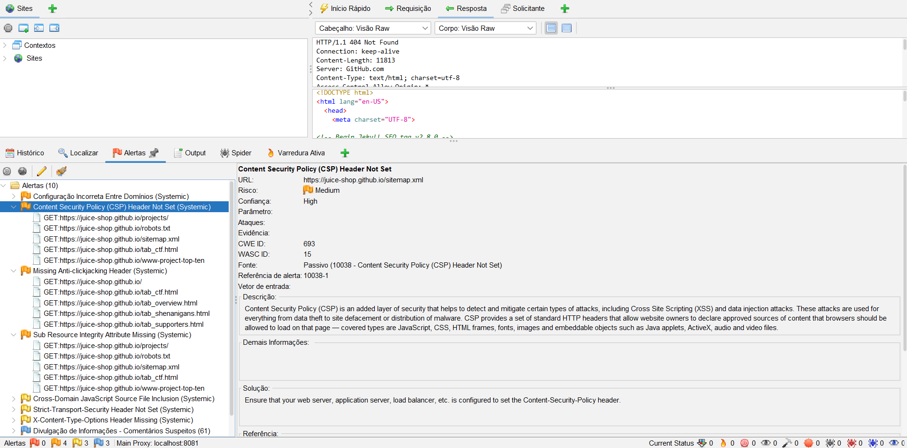

# Documento Principal de Modelagem de Ameaças e Análise de Riscos — ESS

## Sumário
- [1.1 Identificação do Sistema](#11-identificação-do-sistema)
- [1.2 Descrição do Sistema](#12-descrição-do-sistema)
- [1.3 Usuários, ativos e pontos de interação](#13-usuários-ativos-e-pontos-de-interação)
- [1.4 Visão Geral da Arquitetura](#14-visão-geral-da-arquitetura)
- [1.5 Modelagem STRIDE](#15-modelagem-stride)
- [1.6 Casos de Abuso](#16-casos-de-abuso)
- [1.7 Considerações Finais — Etapa 1](#17-considerações-finais--etapa-1)
- [Etapa 2 — Análise, Priorização e Tratamento de Riscos (NIST CSF 2.0)](#etapa-2--análise-priorização-e-tratamento-de-riscos-nist-csf-20)
- [2. Análise e priorização dos riscos](#2-análise-e-priorização-dos-riscos)
  - [2.1 Critérios de probabilidade](#21-critérios-de-probabilidade)
  - [2.2 Critérios de impacto](#22-critérios-de-impacto)
  - [2.3 Cálculo e classificação](#23-cálculo-e-classificação)
  - [2.4 Registro de riscos](#24-registro-de-riscos)
- [2.5 Justificativa das Avaliações](#25-justificativa-das-avaliações)
- [2.6 Priorização dos Riscos](#26-priorização-dos-riscos)
- [2.7 Estratégias de Tratamento](#27-estratégias-de-tratamento)
- [2.8 Apresentação das Funções do NIST CSF 2.0](#28-apresentação-das-funções-do-nist-csf-20)
- [2.9 Mapeamento dos Riscos para as Funções do NIST CSF](#29-mapeamento-dos-riscos-para-as-funções-do-nist-csf)
- [2.10 Plano de Tratamento](#210-plano-de-tratamento)
- [2.11 Ordem Inicial de Implementação](#211-ordem-inicial-de-implementação)
- [2.12 Estimativa do Risco Residual](#212-estimativa-do-risco-residual)
- [2.13 Considerações Finais da Etapa 2](#213-considerações-finais-da-etapa-2)
- [Etapa 3 — Projeto de uma Arquitetura Segura](#etapa-3--projeto-de-uma-arquitetura-segura)
  - [3.1 Requisitos de Segurança](#31-requisitos-de-segurança)
  - [3.2 Vulnerabilidades Catalogadas](#32-vulnerabilidades-catalogadas)
  - [3.3 Diagrama da Arquitetura Segura](#33-diagrama-da-arquitetura-segura)
  - [3.4 Decisões de Arquitetura](#34-decisões-de-arquitetura)
- [Etapa 4 — Código Seguro e Testes de Segurança](#etapa-4--código-seguro-e-testes-de-segurança)
  - [4.1 Escolha das Práticas](#41-escolha-das-práticas)
  - [4.2 Testes e Implementação](#42-testes-e-implementação)
- [Etapa 5 — Verificação de Vulnerabilidades](#etapa-5--verificação-de-vulnerabilidades)
  - [5.1 Configuração da Verificação](#51-configuração-da-verificação)
  - [5.2 Evidência da Execução](#52-evidência-da-execução)
  - [5.3 Análise de Alertas e Correções](#53-análise-de-alertas-e-correções)
- [Etapa 6 — Monitoramento e Detecção de Intrusões](#etapa-6--monitoramento-e-detecção-de-intrusões)
  - [6.1 Fundamentação Teórica](#61-fundamentação-teórica)
  - [6.2 Regras de Detecção](#62-regras-de-detecção)
- [Etapa 7 — DevSecOps e Vídeo Final](#etapa-7--devsecops-e-vídeo-final)
  - [7.1 Fluxo DevSecOps da Equipe](#71-fluxo-devsecops-da-equipe)
  - [7.2 Tabela de Continuidade do Pipeline](#72-tabela-de-continuidade-do-pipeline)
  - [7.3 Condições de Bloqueio](#73-condições-de-bloqueio)
---

> **Disciplina:** Engenharia de Software Seguro — Codefólio  
> **Sistema Analisado:** App de Delivery de Comida *(Plataforma Integrada de Pedidos e Entregas Online)*

---

## 1.1 Identificação do Sistema

* **Nome do Sistema:** App de Delivery de Comida *(Plataforma Integrada de Pedidos e Entregas Online)*
* **Endereço do Repositório:** [https://github.com/gabrieldm-arch/Grupo-2-ES-Seguro](https://github.com/gabrieldm-arch/Grupo-2-ES-Seguro)
* **Integrantes do Grupo:**
  * **Gabriel Martinez**
  * **Kaique Schio**
  * **Pedro Ayres**

### Justificativa para a Escolha do Sistema
O ecossistema de um aplicativo de entrega de comida foi selecionado por ser um ambiente computacional amplamente distribuído e crucial do ponto de vista da segurança da informação. Os principais motivos que nos levam a escolher são:
1. **Múltiplos perfis e níveis de privilégio:** A plataforma conecta ao mesmo tempo Clientes, que são os consumidores finais, Restaurantes/Estabelecimentos, Entregadores e Administradores, o que demanda um controle estrito de autenticação e divisão de privilégios.
2. **Ativos críticos e dados sensíveis:** Armazenamento e circulação de dados pessoais, como CPF, endereço residencial, números de telefone, dados bancários/cartões de crédito, histórico de pedidos e rastreamento de geolocalização em tempo real, em conformidade com a LGPD.
3. **Operações financeiras e vulnerabilidade à fraude:** Transações constantes por meio de PIX, cartões e carteiras digitais, além de procedimentos de estorno, cupons de desconto e transferências de pagamento, que costumam ser alvos de fraudes por agentes mal-intencionados.
4. **Superfície de ataque ampliada:** Integração abrangente com APIs externas, gateways de pagamento, serviços de geolocalização, como o maps, e sistemas de mensagem/notificação, possibilitando a aplicação de todas as categorias de ameaças da metodologia **STRIDE**.

---

## 1.2 Descrição do Sistema

O **App de Delivery de Comida** é uma plataforma distribuída constituída por aplicativos móveis (Android/iOS), portal web para estabelecimentos e painel administrativo, interligados via serviços de API backend.

### 1. Qual problema o sistema resolve
O sistema resolve o problema de intermediação eficiente e em tempo real entre o **setor de alimentação**, **consumidores** e **entregadores independentes**. Ele consolida em uma única plataforma:
* A digitalização de cardápios e recebimento automatizado de pedidos para os restaurantes.
* A facilidade de descoberta, pagamento digital e acompanhamento logístico para os clientes.
* A distribuição otimizada de rotas de entrega e repasses financeiros para os entregadores parceiros.

### 2. Quem utiliza o sistema (Atores e Perfis de Acesso)
* **Clientes (Consumidores):** Usuários que buscam restaurantes, realizam pedidos, efetuam pagamentos digitais, utilizam cupons promocionais e acompanham a geolocalização do pedido até a entrega.
* **Restaurantes / Estabelecimentos Parceiros:** Operadores que utilizam o portal parceiro para cadastrar itens, definir preços, gerenciar estoque, aceitar/recusar pedidos e visualizar relatórios de repasses financeiros.
* **Entregadores (Parceiros Logísticos):** Usuários móveis que recebem chamadas de corrida, visualizam endereços de coleta e entrega, confirmam retiradas com códigos de segurança e comunicam-se via chat restrito com clientes e restaurantes.
* **Administradores da Plataforma:** Equipe técnica e operacional com poderes elevados para gestão de cadastros, aprovação de estabelecimentos/entregadores, moderação de disputas (estornos, denúncias), parametrização de comissões e auditoria do sistema.

### 3. Quais são as principais funcionalidades
* **Gestão de Identidade e Acesso (IAM):** Cadastro e autenticação de usuários, autenticação multifator (MFA/TOTP) para operações sensíveis, recuperação de credenciais e gestão de perfis em conformidade com a LGPD.
* **Catálogo Georreferenciado e Pedidos:** Busca de estabelecimentos próximos com base nas coordenadas GPS, personalização do pedido, cálculo automático de frete e gestão do carrinho de compras.
* **Gateway e Processamento de Pagamentos:** Cobrança via cartões de crédito/débito, PIX e saldo em carteira digital, com aplicação de regras de antifraude, validação de cupons promocionais e processamento do repasse aos parceiros.
* **Logística e Rastreamento em Tempo Real:** Roteamento e despacho de entregadores, acompanhamento GPS ao vivo da coleta à entrega e validação de conclusão de entrega via código OTP.
* **Mensageria e Notificações:** Sistema de chat integrado entre Cliente-Entregador e Cliente-Restaurante (com mascaramento de telefone para proteção da privacidade) e envio de notificações push/SMS sobre o status do pedido.

### 4. Quais informações são armazenadas ou transmitidas
* **Dados Pessoais Sensíveis e Cadastrais (LGPD):** Nome completo, CPF, e-mail, telefone, endereço residencial/entrega e data de nascimento.
* **Dados Financeiros e de Faturamento:** Tokens vinculados a cartões bancários (via gateway PCI-DSS), chaves PIX, histórico de pedidos, cupons aplicados, extratos de repasse e notas fiscais.
* **Dados Geolocalizados:** Histórico de rotas e coordenadas GPS precisas e contínuas de entregadores em serviço e endereços de destino de clientes.
* **Dados Operacionais e de Auditoria:** Logs de requisições às APIs, registros de chat entre usuários, avaliações/reviews de lojas e entregadores e históricos de cancelamento/estorno.

### 5. Quais recursos precisam ser protegidos
Para subsidiar a modelagem de ameaças e mitigação de abusos, destacam-se os principais ativos de segurança da plataforma:
* **Banco de Dados Central (PII e Pedidos):** Base que armazena todas as informações pessoais dos clientes, parceiros e histórico transacional; alvo principal para ataques de vazamento de informações (*Information Disclosure*).
* **APIs de Checkout e Gateway de Pagamento:** Endpoints de cobrança, aplicação de cupons e repasse financeiro que devem ser imunes a manipulação de preços ou autorizações indevidas (*Tampering / Elevation of Privilege*).
* **Sessões e Tokens de Autenticação (JWT/OAuth2):** Chaves de acesso e tokens de sessão que garantem a autenticação e autorização de cada usuário sem permitir sequestro de contas (*Spoofing*).
* **Serviço de Comunicação e Roteamento GPS:** Mecanismos que garantem a disponibilidade logística e impedem rastreamento indevido ou interceptação de conversas privadas entre clientes e parceiros.
* **Servidores e Infraestrutura de Backend:** Ambiente de execução de microserviços, filas de mensagens e balanceadores de carga, que precisam estar protegidos contra ataques de negação de serviço (*Denial of Service - DoS*).

---

## 1.3 Usuários, ativos e pontos de interação

O sistema de Delivery interliga dezenas de componentes. Abaixo estão mapeados os principais elementos e recursos do ecossistema, segmentados por categoria:

### Usuários e Perfis de Acesso
- **Cliente:** O consumidor final, com acesso via App Mobile e Web.
- **Parceiro (Restaurante):** O operador do estabelecimento, com acesso via Portal Web do Parceiro.
- **Entregador:** O parceiro logístico motorizado/ciclista, com acesso via App Mobile do Entregador.
- **Administrador:** O integrante do suporte/gestão da plataforma, com acesso via Painel Admin Web.

### Credenciais e Autenticação
- Senhas com hash criptográfico, tokens temporários (OTP/PIN via SMS e E-mail).
- Tokens de sessão (JWT) e tokens OAuth2 para logins sociais (Google/Apple).

### Pagamentos e Financeiro
- Dados bancários, cartões de crédito (acessíveis à plataforma apenas de forma tokenizada pelo Gateway parceiro).
- Chaves PIX, histórico de compras, carteiras digitais (cashback/saldo) e registros de repasses/comissões.

### Localização, Mensagens e Avaliações
- **GPS:** Histórico e coordenadas em tempo real (posição do entregador e endereço exato de residência do cliente).
- **Chat:** Sistema de mensageria interna para dúvidas sobre o pedido e contato direto (com mascaramento de números).
- **Reviews:** Avaliações de qualidade, fotos de recebimentos e comentários sobre a conduta de entregadores/lojas.

### Arquitetura: Servidores, Bancos de Dados e Aplicações
- **Aplicações (Front-end):** Aplicativos nativos iOS/Android (Clientes e Entregadores) e SPAs Web (Painéis de Restaurantes/Admin).
- **Servidores (Back-end):** Servidores Cloud em provedor de nuvem, APIs de Backend (microsserviços REST/GraphQL), balanceadores de carga e filas de mensagens para processamento assíncrono (RabbitMQ/Kafka).
- **Banco de Dados:** Bancos relacionais (ex.: PostgreSQL para transações, pedidos e controle de saldos) e não-relacionais (ex.: MongoDB para logs, histórico de chat e avaliações).

### Serviços Externos e APIs
- **APIs de Pagamento:** Conexões externas para processamento de cobranças e estornos (ex.: Stripe, MercadoPago, Pagar.me).
- **APIs de Mapeamento:** Conexões para cálculo de rota e distância (ex.: Google Maps, Mapbox).
- **APIs de Comunicação:** Serviços de envio de e-mails, SMS e Push Notifications (ex.: Twilio, Firebase, SendGrid).

### Ativos Críticos Destacados
Os recursos que podem causar os maiores prejuízos, como financeiros, regulatórios, legais ou de reputação, caso sejam acessados, alterados, destruídos ou indisponibilizados indevidamente são:

1. **Bancos de Dados de Pagamentos e PII (Informações Pessoalmente Identificáveis):**
   * Contém CPFs, endereços, perfis comportamentais e saldos. Uma falha de segurança levaria a multas milionárias da LGPD e destruição da confiança da base de clientes.
2. **APIs e Gateway de Pagamentos:**
   * Se um atacante forjar requisições ou se passar por um restaurante, pode drenar fundos, aprovar pedidos sem pagar ou alterar as contas de repasse.
3. **Serviços de Roteamento (GPS) e Chat Privado:**
   * A interceptação em tempo real do GPS ou das conversas pode colocar em risco a segurança física dos usuários, como entregadores e clientes, em caso de perseguições, assaltos ou golpes no momento da entrega.
4. **Infraestrutura Cloud de Microsserviços e Filas de Mensagens:**
   * A indisponibilidade da nuvem ou interrupção no despacho de pedidos por algumas poucas horas, especialmente em horários de pico, como finais de semana, gera um prejuízo direto no faturamento.

---

## 1.4 Visão Geral da Arquitetura

Para ilustrar as interações no sistema, elaboramos um **Diagrama de Casos de Uso**, que mapeia as principais ações realizadas pelos quatro atores fundamentais da plataforma: **Cliente**, **Restaurante**, **Entregador** e **Administrador**.

### Documentação Descritiva do Diagrama
O diagrama representa a fronteira do sistema de Delivery e as interações diretas de cada perfil de usuário:
* **Cliente:** Interage com a vitrine do aplicativo, onde pode pesquisar restaurantes, realizar pedidos, efetuar pagamentos e acompanhar a rota da entrega em tempo real.
* **Restaurante (Parceiro):** Focado na operação do estabelecimento. Gerencia seu cardápio, aceita ou recusa os pedidos recebidos e atualiza o status de preparo para notificar o cliente e o entregador.
* **Entregador:** Focado na logística. Recebe e aceita chamados de corrida, confirma a retirada no restaurante e, finalmente, confirma a entrega no endereço do cliente.
* **Administrador:** Possui visão gerencial de retaguarda. É responsável por gerenciar os cadastros (aprovar restaurantes e entregadores) e moderar disputas (como pedidos não entregues ou solicitações de estorno).

## 1.5 Modelagem STRIDE

A tabela a seguir apresenta a análise de ameaças utilizando a metodologia STRIDE. Cada categoria foi mapeada com foco estrito nas operações, ativos críticos e perfis de acesso (clientes, restaurantes, entregadores e administradores) presentes no ecossistema da plataforma de delivery.

| Categoria STRIDE | Descrição da Ameaça | Ativo/Ponto de Interação Afetado | Cenário de Ataque | Impacto Principal |
| :--- | :--- | :--- | :--- | :--- |
| **Spoofing** | Um ator malicioso assume a identidade de um usuário legítimo (cliente, entregador ou restaurante). | Sessões e Tokens de Autenticação (JWT/OAuth2). | Um atacante consegue roubar o token de sessão de um entregador e utiliza seu perfil no aplicativo para aceitar corridas com o único intuito de furtar as refeições coletadas nos restaurantes. | Roubo de mercadorias, risco à segurança física dos clientes e dano severo à reputação da plataforma. |
| **Tampering** | Alteração indevida de dados em trânsito ou informações armazenadas no sistema. | APIs de Checkout e Gateway de Pagamento. | Um cliente mal-intencionado intercepta a requisição HTTP de finalização do pedido e altera o parâmetro do valor final para R$ 0,00 antes de enviá-la para a API de cobrança. | Fraude financeira direta, perda de receita para a plataforma e falha no repasse aos restaurantes parceiros. |
| **Repudiation** | Um usuário nega ter realizado uma ação (ex: compra, entrega) e o sistema não possui logs/provas suficientes para contestá-lo. | App do Entregador, Logs de Auditoria. | Um cliente recebe seu pedido corretamente, mas entra em contato com o suporte afirmando que o entregador nunca apareceu, exigindo o estorno do valor (golpe do estorno/chargeback). | Prejuízos financeiros para a plataforma ou restaurante, além de possível banimento injusto do parceiro logístico. |
| **Information Disclosure** | Exposição ou vazamento de dados sensíveis e pessoais a agentes não autorizados. | Banco de Dados Central (PII e Pedidos), Serviços de Roteamento (GPS). | Uma vulnerabilidade no banco de dados central (IDOR) permite que um atacante extraia em massa CPFs, endereços residenciais e o histórico de coordenadas de entregas. | Multas milionárias por infração à LGPD, exposição física dos usuários e quebra total de confiança. |
| **Denial of Service** | Sobrecarga de recursos que torna o sistema indisponível para usuários legítimos. | Servidores e Infraestrutura de Backend, Filas de Mensagens. | Uma *botnet* inunda as APIs de catálogo de restaurantes e roteamento com milhares de requisições simultâneas durante um horário de pico (ex: sexta-feira à noite). | Indisponibilidade total do aplicativo, impedindo novos pedidos e gerando prejuízo massivo no faturamento diário. |
| **Elevation of Privilege** | Um usuário comum obtém permissões de acesso superiores às do seu perfil (ex: administrador). | Painel Admin Web, Gestão de Identidade (IAM). | Um perfil de restaurante explora uma falha de autorização (Broken Access Control) no portal web e consegue acessar endpoints exclusivos da equipe de Administração, alterando a própria taxa de comissão para 0%. | Comprometimento sistêmico, fraudes internas em larga escala e manipulação das regras de negócio do delivery. |

## 1.6 Casos de Abuso

| ID | Caso de Abuso | Categoria STRIDE | Ativo/Ponto de Interação Afetado | Ator Malicioso | Pré-condição | Fluxo do Abuso | Impacto | Contramedidas |
| :--- | :--- | :--- | :--- | :--- | :--- | :--- | :--- | :--- |
| **CA-01** | Sequestro de Sessão de Entregador | Spoofing | Sessões e Tokens de Autenticação (JWT/OAuth2) | Atacante externo | Atacante obteve o token JWT de um entregador ativo via phishing, sniffing em rede insegura ou malware no dispositivo móvel | Atacante captura o token JWT do entregador → configura o token no cabeçalho Authorization → autentica-se na API do app do entregador → aceita corridas e coleta pedidos nos restaurantes → pedidos nunca são entregues ao cliente | Roubo de mercadorias, risco à segurança física dos clientes e dano severo à reputação da plataforma | Vincular o token JWT ao `device_id` e IP de origem; tokens de curta expiração (15 min) com refresh token rotativo; MFA/TOTP obrigatório no login do entregador; alerta de sessão simultânea em outro dispositivo |
| **CA-02** | Manipulação do Valor de Pedido na Requisição | Tampering | APIs de Checkout e Gateway de Pagamento | Cliente mal-intencionado | Cliente utiliza proxy HTTP (ex.: Burp Suite, mitmproxy) para interceptar o tráfego entre o app mobile e a API de backend | Cliente intercepta a requisição `POST /checkout` → altera o campo `total_amount` de R$ 89,90 para R$ 0,00 → envia a requisição modificada ao servidor → backend aprova o pedido sem cobrança → restaurante prepara e entregador leva sem que o pagamento ocorra | Fraude financeira direta, perda de receita para a plataforma e falha no repasse aos restaurantes parceiros | Backend sempre recalcula o total com base nos preços do banco de dados; assinatura HMAC do payload do carrinho; rejeitar transação se valor recebido divergir do valor calculado no servidor |
| **CA-03** | Golpe do Estorno por Falsa Não-Entrega | Repudiation | App do Entregador, Logs de Auditoria | Cliente desonesto | Sistema não registra provas irrefutáveis da conclusão da entrega (OTP, foto, log de geolocalização com timestamp) | Entregador conclui a entrega → cliente recebe o pedido mas não confirma no app → cliente abre chamado alegando não-entrega → plataforma, sem provas sólidas, defere o estorno → entregador e/ou restaurante arcam com o prejuízo → cliente repete o golpe em pedidos futuros | Prejuízos financeiros recorrentes para a plataforma e restaurantes; banimento injusto de entregadores honestos | Código OTP de confirmação de entrega validado no ato da entrega; registro de geolocalização com timestamp ao marcar "entregue"; foto obrigatória da entrega armazenada em log imutável; análise de comportamento para clientes com histórico de estornos frequentes |
| **CA-04** | Extração em Massa de Dados Pessoais por IDOR | Information Disclosure | Banco de Dados Central (PII e Pedidos), Serviços de Roteamento (GPS) | Atacante externo | Existência de vulnerabilidade IDOR em endpoints da API que retornam dados de usuários por identificadores sequenciais ou previsíveis | Atacante cria conta legítima → observa sua requisição `GET /api/profile/10432` → itera sobre IDs vizinhos → recebe dados de outros usuários → automatiza a extração em massa → exfiltra CPFs, endereços, GPS e histórico de compras | Multas milionárias por infração à LGPD, exposição física dos usuários e quebra total de confiança | Autorização baseada em objeto (verificar se o usuário tem permissão sobre o recurso solicitado); uso de UUIDs não sequenciais; rate limiting nos endpoints de perfil; alertas automáticos para requisições a múltiplos IDs distintos em curto intervalo |
| **CA-05** | DDoS por Botnet em Horário de Pico | Denial of Service | Servidores e Infraestrutura de Backend, Filas de Mensagens | Atacante externo (operador de botnet) | Plataforma sem rate limiting robusto, WAF ou proteção anti-DDoS nos endpoints públicos | Atacante agenda ataque para horário de pico → botnet envia ~50.000 req/s aos endpoints `/search` e `/catalog` → servidores atingem limite de capacidade → filas de mensagens acumulam backlog inprocessável → plataforma fica indisponível | Indisponibilidade total do aplicativo, impedindo novos pedidos e gerando prejuízo massivo no faturamento diário | Rate limiting por IP e por usuário; WAF com detecção de tráfego anômalo; proteção anti-DDoS na infraestrutura (ex.: Cloudflare, AWS Shield); auto-scaling; circuit breaker nas filas de mensagens |
| **CA-06** | Escalonamento de Privilégio via Broken Access Control | Elevation of Privilege | Painel Admin Web, Gestão de Identidade (IAM) | Operador de restaurante mal-intencionado | Endpoints administrativos protegidos apenas por autenticação, sem verificação de autorização por papel (role) | Operador autentica-se no portal parceiro → inspeciona chamadas de rede → identifica `PATCH /api/admin/commissions/998` → replica a requisição com seu próprio token JWT → backend valida apenas a autenticação, não o role → comissão é zerada | Comprometimento sistêmico, fraudes financeiras em larga escala e manipulação das regras de negócio do delivery | RBAC: verificar explicitamente o papel do usuário em todo endpoint; princípio do menor privilégio; tokens de parceiros e administradores com escopos distintos no JWT; testes SAST/DAST cobrindo escalonamento de privilégio |

## 1.7 Considerações Finais — Etapa 1

Esta seção sintetiza os principais resultados da análise de segurança realizada na Etapa 1, consolidando as ameaças mais preocupantes, os ativos de maior valor, os casos de abuso de maior impacto potencial e as principais dificuldades encontradas pelo grupo durante o processo de análise.

---

### Ameaças mais preocupantes

A aplicação do STRIDE ao ecossistema de delivery revelou um conjunto de ameaças que, pelo seu potencial de dano combinado e pela facilidade relativa de exploração, merecem atenção prioritária:

**Information Disclosure — Extração em Massa por IDOR (T07 / CA-04)**
A ameaça de exposição de dados pessoais por meio de vulnerabilidade IDOR nos endpoints da API é considerada a mais crítica do ponto de vista regulatório e de impacto social. O sistema armazena CPF, endereço residencial, histórico de geolocalização e dados financeiros de potencialmente milhões de usuários. Uma única vulnerabilidade de controle de acesso em nível de objeto pode permitir a extração automatizada de toda essa base, resultando em sanções administrativas da ANPD, ações judiciais coletivas e destruição irreversível da confiança dos usuários. O agravante é que esse tipo de vulnerabilidade frequentemente passa despercebido em testes convencionais, exigindo testes específicos de autorização por objeto.

**Spoofing — Sequestro de Sessão de Entregador (T01 / CA-01)**
O comprometimento da conta de um entregador ativo representa uma ameaça multidimensional: além do impacto financeiro imediato com o desvio de pedidos, coloca em risco a segurança física dos clientes que aguardam a entrega e dos entregadores legítimos que são penalizados indevidamente. A ausência de MFA obrigatório e de vinculação do token JWT ao dispositivo de origem são condições que tornam essa ameaça particularmente explorável com técnicas de baixo custo, como phishing direcionado.

**Elevation of Privilege — Broken Access Control no Painel Administrativo (T12 / CA-06)**
A possibilidade de um operador de restaurante acessar endpoints administrativos por falha de verificação de papel (*role*) representa uma ameaça sistêmica. Diferente de ataques externos, essa exploração é realizada com credenciais legítimas, tornando-a mais difícil de detectar. O impacto vai além do caso específico de zeragem de comissão: um atacante com acesso ao painel administrativo pode manipular regras de negócio, acessar dados de todos os parceiros e comprometer a integridade financeira da plataforma.

**Tampering — Manipulação do Valor do Pedido (T03 / CA-02)**
A adulteração de parâmetros financeiros em requisições HTTP decorre de um erro de design recorrente em sistemas de e-commerce: delegar ao cliente a responsabilidade de informar o valor correto da transação. Embora a mitigação seja tecnicamente simples (recálculo obrigatório no servidor), o impacto enquanto a vulnerabilidade existir é financeiro e direto, afetando simultaneamente a plataforma e os restaurantes parceiros.

---

### Ativos mais importantes

A análise identificou quatro ativos cuja proteção é considerada essencial para a viabilidade operacional, financeira e legal da plataforma:

**1. Banco de Dados Central (PII e Pedidos)**
É o ativo de maior criticidade do sistema. Concentra CPFs, endereços, histórico de consumo, coordenadas de geolocalização e dados comportamentais de todos os usuários. Seu comprometimento implica consequências regulatórias (LGPD/ANPD), financeiras (multas e indenizações) e reputacionais de difícil reversão. Qualquer ameaça que resulte em acesso não autorizado a este banco deve ser tratada como crítica, independentemente do vetor de ataque utilizado.

**2. APIs de Checkout e Gateway de Pagamento**
Representam o núcleo financeiro da plataforma. Falhas nesses endpoints impactam diretamente a receita da plataforma, o repasse aos restaurantes parceiros e a confiança dos clientes nas transações. A integridade dessas APIs é condição necessária para a operação sustentável do negócio.

**3. Sessões e Tokens de Autenticação (JWT/OAuth2)**
O controle de acesso de toda a plataforma depende da integridade desses tokens. O comprometimento de um token de qualquer perfil — especialmente administrador ou restaurante — pode dar a um atacante acesso a funcionalidades e dados muito além do previsto para aquela identidade. A gestão adequada do ciclo de vida dos tokens (expiração curta, rotação, vinculação ao dispositivo) é um controle fundamental e transversal a todas as categorias do STRIDE.

**4. Infraestrutura de Backend e Filas de Mensagens**
A disponibilidade do serviço em horários de pico é um requisito de negócio crítico. A indisponibilidade da infraestrutura por algumas horas em um final de semana representa prejuízo direto no faturamento, perda de clientes para concorrentes e dano à reputação da plataforma. Este ativo é o alvo primário das ameaças de Denial of Service identificadas (T10, T11 / CA-05).

---

### Casos de abuso de maior impacto potencial

Considerando a combinação de facilidade de exploração, escala do dano e dificuldade de detecção:

| Posição | Caso de Abuso | Ameaças relacionadas | Motivo do destaque |
| :---: | :--- | :---: | :--- |
| 1º | **CA-04** — Extração em Massa por IDOR | T07 | Impacto regulatório e social massivo; exploração automatizável; difícil detecção sem monitoramento específico |
| 2º | **CA-06** — Broken Access Control no Painel Admin | T12 | Comprometimento sistêmico das regras de negócio; realizado com credenciais legítimas; impacto financeiro em larga escala |
| 3º | **CA-05** — DDoS por Botnet em Horário de Pico | T10, T11 | Impacto operacional imediato e visível; afeta todos os usuários simultaneamente; custo de ataque baixo para o atacante |
| 4º | **CA-01** — Sequestro de Sessão de Entregador | T01 | Impacto multidimensional (financeiro, físico e reputacional); explora vetor humano amplamente disponível (phishing) |
| 5º | **CA-02** — Manipulação do Valor do Pedido | T03 | Prejuízo financeiro direto e recorrente; exploração de erro de design frequente; escalável para múltiplos atacantes |
| 6º | **CA-03** — Golpe do Estorno por Falsa Não-Entrega | T05 | Impacto financeiro recorrente e dano a entregadores legítimos; difícil de combater sem evidências sólidas de entrega |

---

### Principais dificuldades encontradas

**Delimitação do escopo da análise**
Um sistema de delivery real é composto por dezenas de microsserviços, integrações externas e fluxos de dados complexos. Definir o nível de granularidade adequado — suficientemente detalhado para ser útil, mas sem tornar o documento excessivamente extenso — exigiu diversas revisões e decisões de escopo ao longo da análise.

**Diferenciação entre ameaça, vulnerabilidade e caso de abuso**
No início da análise, o grupo teve dificuldade em distinguir com clareza o que constitui uma ameaça (o que pode acontecer), uma vulnerabilidade (a condição que permite que aconteça) e um caso de abuso (a narrativa de como um atacante exploraria essa condição na prática). A estruturação iterativa do documento, com revisões cruzadas entre as seções 1.5 e 1.6, foi necessária para garantir a coerência entre essas camadas.

**Estimativa de impacto sem dados reais**
Como o sistema analisado é hipotético, a avaliação de impacto das ameaças precisou ser baseada em referências do setor e analogias com incidentes reais em plataformas similares, sem acesso a métricas concretas de faturamento, base de usuários ou histórico de incidentes. Isso introduz uma margem de subjetividade que precisará ser revisada em etapas futuras com dados mais concretos.

**Cobertura equilibrada de todas as categorias do STRIDE**
Algumas categorias, como Repudiation e Elevation of Privilege, são menos intuitivas do que Spoofing ou Denial of Service no contexto de delivery. Garantir que todas as seis categorias recebessem ameaças concretas e contextualizadas — e não apenas definições genéricas — demandou esforço adicional de pesquisa e revisão entre os integrantes do grupo.

---

### Síntese geral

A análise da Etapa 1 evidenciou que o ecossistema de um aplicativo de delivery concentra, em um único sistema, praticamente todos os vetores de ameaça contemplados pela metodologia STRIDE. A multiplicidade de perfis de usuário, a sensibilidade dos dados armazenados, o volume de transações financeiras e a dependência de integrações externas compõem uma superfície de ataque ampla e heterogênea.

Os resultados desta etapa indicam que as prioridades de segurança da plataforma devem se concentrar, nesta ordem, em: (1) proteção e controle de acesso granular ao banco de dados central; (2) validação *server-side* de todas as operações financeiras sem confiar em dados enviados pelo cliente; (3) gestão robusta do ciclo de vida de tokens e sessões com MFA; e (4) implementação de controles de autorização por papel (RBAC) em todos os endpoints da API, sem exceção.

Essas prioridades serão formalizadas na Etapa 2, onde as ameaças identificadas serão transformadas em eventos de risco quantificados, priorizados e associados a planos de tratamento concretos com base no NIST Cybersecurity Framework 2.0.

---

# Etapa 2 — Análise, Priorização e Tratamento de Riscos (NIST CSF 2.0)

## 2. Análise e priorização dos riscos

Nesta etapa, transformamos as ameaças mapeadas na Etapa 1 em eventos de risco concretos para o aplicativo de delivery, adotando as escalas de probabilidade e impacto sugeridas para quantificação.

### 2.1 Critérios de probabilidade

A probabilidade avalia a chance de a ameaça ser explorada com sucesso, considerando as características do nosso sistema, o perfil dos atacantes e as vulnerabilidades do delivery. Utilizamos a seguinte escala:

| Valor | Classificação | Critério |
| :---: | :--- | :--- |
| **1** | **Baixa** | O evento depende de condições incomuns, acesso muito específico ou grande capacidade técnica. |
| **2** | **Média-baixa** | O evento é possível, mas depende de uma vulnerabilidade ou condição específica. |
| **3** | **Média-alta** | O evento é plausível e pode ocorrer em situações comuns de uso ou ataque. |
| **4** | **Alta** | O evento pode ocorrer com facilidade, frequência ou durante condições previsíveis do sistema. |

### 2.2 Critérios de impacto

O impacto avalia os prejuízos e consequências que o evento de risco trará ao aplicativo, aos usuários (clientes, parceiros, entregadores) e ao modelo de negócios. Consideramos perdas financeiras, exposição de PII (LGPD), danos à reputação e interrupção do serviço. Utilizamos a seguinte escala:

| Valor | Classificação | Critério |
| :---: | :--- | :--- |
| **1** | **Baixo** | Causa pequeno transtorno e pode ser corrigido rapidamente. |
| **2** | **Moderado** | Causa interrupção ou inconsistência limitada, com possibilidade de recuperação. |
| **3** | **Alto** | Causa prejuízo relevante aos usuários, ao negócio, à administração ou à privacidade. |
| **4** | **Muito alto** | Pode afetar muitos usuários, comprometer operações críticas ou causar prejuízo grave. |

### 2.3 Cálculo e classificação

A pontuação de cada risco será calculada multiplicando a probabilidade pelo impacto (`Pontuação = Probabilidade × Impacto`). O resultado define a prioridade de atenção que devemos dar ao evento:

| Pontuação | Nível do risco |
| :---: | :--- |
| **1 a 3** | **Baixo** |
| **4 a 7** | **Médio** |
| **8 a 11** | **Alto** |
| **12 a 16** | **Crítico** |

### 2.4 Registro de riscos

A partir das ameaças e casos de abuso levantados na Etapa 1, os eventos foram transformados na seguinte matriz de riscos (R01 a R06).

| ID | Origem STRIDE | Evento de risco | Vulnerabilidade ou condição | Probabilidade | Impacto | Pontuação | Nível |
| :---: | :--- | :--- | :--- | :---: | :---: | :---: | :---: |
| **R01** | Spoofing (CA-01) | Sequestro de Sessão do Entregador, resultando em roubo de pedidos | Token JWT interceptável via rede insegura e ausência de verificação adicional de dispositivo | 3 | 4 | **12** | **Crítico** |
| **R02** | Tampering (CA-02) | Manipulação do Valor do Pedido para forjar compras gratuitas | Aceitação de valores calculados no front-end sem recálculo/validação rígida no servidor | 3 | 3 | **9** | **Alto** |
| **R03** | Repudiation (CA-03) | Golpe do Estorno (falsa alegação de não entrega) | Falta de evidências irrefutáveis de recebimento (ex: OTP, GPS log e assinatura fotográfica) | 4 | 2 | **8** | **Alto** |
| **R04** | Info. Disclosure (CA-04) | Extração em Massa de Dados (IDOR) e vazamento de PII da base inteira | Uso de IDs sequenciais nas APIs sem validação forte de autorização sobre os objetos | 3 | 4 | **12** | **Crítico** |
| **R05** | DoS (CA-05) | DDoS por Botnet derrubando a plataforma em horário de pico (ex: sexta à noite) | Endpoints de catálogo e busca abertos sem *Rate Limiting* ou proteção de Web Application Firewall | 3 | 4 | **12** | **Crítico** |
| **R06** | Elevation of Privilege (CA-06)| Broken Access Control permitindo a parceiros acessar endpoints de Admin e zerar comissões | Endpoints verificam apenas autenticação (estar logado) e não o papel (role-based access control) | 2 | 4 | **8** | **Alto** |
## 2.5 Justificativa das Avaliações

Esta seção explica os valores de probabilidade e impacto atribuídos a cada risco na seção 2.4, detalhando os critérios considerados para cada avaliação com base nas características do sistema, no perfil dos atacantes e nas condições de exploração identificadas.

---

### R01 — Sequestro de Sessão do Entregador (Spoofing / CA-01)

**Probabilidade: 3 — Média-alta**
O ataque depende de o adversário obter o token JWT do entregador, o que pode ser feito por phishing direcionado, sniffing em redes Wi-Fi abertas ou malware em dispositivos móveis. Essas três técnicas são amplamente disponíveis, não exigem conhecimento técnico avançado e são rotineiramente utilizadas contra trabalhadores de plataformas digitais. O fato de entregadores frequentemente utilizarem redes públicas durante o expediente — em restaurantes, postos de gasolina e áreas de espera — aumenta consideravelmente a exposição ao sniffing. A probabilidade não foi classificada como 4 (Alta) porque o ataque ainda exige uma etapa prévia de comprometimento do dispositivo ou da rede, representando uma barreira mínima mas existente.

**Impacto: 4 — Muito alto**
O comprometimento da sessão de um entregador ativo afeta simultaneamente múltiplas partes do ecossistema: o cliente que não recebe o pedido e sofre prejuízo financeiro; o restaurante que prepara o pedido sem receber a confirmação de entrega e arca com reclamação indevida; o entregador legítimo que é penalizado automaticamente no sistema de reputação; e a plataforma que absorve o prejuízo financeiro e o dano reputacional. Há ainda um componente de risco físico direto — clientes que aguardam entregas em locais isolados ou residências ficam expostos a situações de vulnerabilidade. O impacto foi classificado como Muito alto por comprometer simultaneamente múltiplos usuários, múltiplos componentes financeiros e a segurança física dos envolvidos.

**Nível: Crítico (3 × 4 = 12)**
O nível Crítico é adequado dado que o vetor humano (phishing) é de difícil eliminação completa, as consequências são imediatas, multidimensionais e afetam toda a cadeia operacional da entrega.

---

### R02 — Manipulação do Valor do Pedido (Tampering / CA-02)

**Probabilidade: 3 — Média-alta**
A técnica de interceptação de requisições HTTP com ferramentas como Burp Suite é amplamente documentada e acessível a qualquer usuário com conhecimento técnico básico. Tutoriais específicos sobre manipulação de parâmetros em APIs de e-commerce e delivery são facilmente encontrados em fóruns públicos. A condição habilitadora — ausência de recálculo server-side, confiando nos valores enviados pelo cliente — é um erro de design recorrente em sistemas que não separam adequadamente a camada de apresentação da camada de negócio. A probabilidade não foi classificada como 4 porque o atacante precisa configurar um proxy HTTP e ter familiaridade mínima com a estrutura de requisições da API, representando uma barreira de entrada moderada.

**Impacto: 3 — Alto**
A manipulação do valor do pedido causa prejuízo financeiro direto para a plataforma e para o restaurante parceiro, que prepara e entrega o pedido sem receber o valor correspondente. Os componentes afetados são: a API de checkout, o gateway de pagamento e o fluxo de repasse ao restaurante. O impacto afeta o modelo de negócio de forma recorrente se explorado sistematicamente por múltiplos atacantes. Não foi classificado como Muito alto (4) porque o prejuízo, embora relevante, é limitado ao valor individual de cada pedido fraudado — não expõe dados pessoais de outros usuários nem compromete a disponibilidade do serviço para a base geral de clientes.

**Nível: Alto (3 × 3 = 9)**
O nível Alto é adequado: o ataque é tecnicamente acessível, o impacto financeiro é direto e recorrente, mas o dano por ocorrência é delimitado ao valor unitário do pedido, diferentemente de ataques que comprometem toda a base de usuários ou a disponibilidade da plataforma.

---

### R03 — Golpe do Estorno por Falsa Não-Entrega (Repudiation / CA-03)

**Probabilidade: 4 — Alta**
Este é o risco de maior probabilidade do registro porque não exige nenhum conhecimento técnico: qualquer cliente desonesto pode alegar não ter recebido um pedido e acionar o suporte solicitando estorno. A condição habilitadora — ausência de evidências irrefutáveis de entrega como OTP, registro de geolocalização com timestamp e fotografia — é uma lacuna operacional que persiste em muitas plataformas de delivery. O comportamento pode ser repetido sistematicamente pelo mesmo usuário em pedidos distintos até ser detectado por análise comportamental, processo que frequentemente demora semanas. A probabilidade foi classificada como 4 (Alta) por ser um comportamento de baixíssima barreira de execução, sem necessidade de nenhuma capacidade técnica, e de alta frequência documentada em plataformas similares.

**Impacto: 2 — Moderado**
Cada ocorrência individual causa prejuízo financeiro limitado ao valor do pedido e eventual penalização indevida do entregador no sistema de reputação. Os componentes afetados são: o sistema de disputas e estornos, o histórico do entregador e o repasse financeiro ao restaurante. O impacto não alcança o nível Alto porque o dano por ocorrência é contido e reversível — a plataforma pode identificar padrões de abuso e banir contas reincidentes. Não compromete dados pessoais de terceiros nem a disponibilidade do serviço para outros usuários. O impacto agregado pode ser relevante se praticado em escala, mas individualmente é classificado como Moderado.

**Nível: Alto (4 × 2 = 8)**
Apesar do impacto unitário moderado, a altíssima probabilidade eleva o nível para Alto. O risco merece atenção prioritária pela frequência com que ocorre em plataformas de delivery e pelo impacto acumulado sobre entregadores e restaurantes parceiros ao longo do tempo.

---

### R04 — Extração em Massa de Dados Pessoais por IDOR (Information Disclosure / CA-04)

**Probabilidade: 3 — Média-alta**
Vulnerabilidades IDOR em APIs REST são extremamente comuns e figuram consistentemente no OWASP Top 10 sob a categoria Broken Access Control. A técnica de enumeração de IDs sequenciais é simples e completamente automatizável com scripts básicos em Python ou ferramentas como Burp Suite Intruder. A condição habilitadora — uso de identificadores sequenciais e previsíveis nos endpoints de perfil sem validação de autorização por objeto — é um erro de design frequente em sistemas que cresceram rapidamente sem revisão de segurança. A probabilidade não foi classificada como 4 porque a exploração em massa requer que o atacante primeiro identifique a vulnerabilidade e desenvolva ou adapte um script de automação, o que representa uma barreira técnica mínima mas existente.

**Impacto: 4 — Muito alto**
O vazamento em massa de CPFs, endereços residenciais, histórico de geolocalização de entregas e dados financeiros de potencialmente milhões de usuários é o cenário de maior impacto regulatório e social do sistema. Os componentes afetados incluem: o banco de dados central de PII, os endpoints de perfil da API, o serviço de rastreamento GPS e os dados financeiros dos parceiros. As consequências abrangem: sanções administrativas da ANPD com multas de até 2% do faturamento anual (LGPD, art. 52); ações judiciais coletivas movidas por titulares afetados; risco físico direto aos usuários cujos endereços residenciais foram expostos; e destruição irreversível da confiança na plataforma. O impacto foi classificado como Muito alto por comprometer potencialmente toda a base de usuários em múltiplas dimensões — financeira, regulatória, reputacional e de segurança física.

**Nível: Crítico (3 × 4 = 12)**
O nível Crítico é plenamente justificado: a vulnerabilidade é tecnicamente acessível, completamente automatizável e resulta no pior cenário possível do ponto de vista regulatório, de privacidade e de segurança física dos usuários.

---

### R05 — DDoS por Botnet em Horário de Pico (Denial of Service / CA-05)

**Probabilidade: 3 — Média-alta**
Serviços de DDoS por aluguel (DDoS-as-a-Service) estão disponíveis na internet a preços acessíveis, tornando esse tipo de ataque viável para adversários sem infraestrutura própria. A condição habilitadora — ausência de rate limiting eficaz e WAF nos endpoints públicos de busca e catálogo — é uma lacuna de infraestrutura comum em plataformas em estágio inicial de maturidade de segurança. Plataformas de delivery são alvos particularmente atrativos por operarem com receita concentrada em janelas de tempo previsíveis (horários de almoço e jantar, sextas-feiras à noite, fins de semana e datas comemorativas), o que permite ao atacante maximizar o impacto com precisão temporal. A probabilidade não foi classificada como 4 porque ataques DDoS direcionados a plataformas específicas ainda requerem motivação deliberada e investimento mínimo, sendo menos oportunistas do que os demais vetores analisados.

**Impacto: 4 — Muito alto**
A indisponibilidade da plataforma durante horários de pico causa prejuízo financeiro direto e imediato para todos os participantes do ecossistema: a plataforma perde receita de comissões; os restaurantes deixam de receber pedidos durante seu período de maior faturamento; os entregadores perdem corridas e renda; e os clientes migram para plataformas concorrentes, gerando perda de mercado de difícil reversão. Os componentes afetados incluem: a infraestrutura de backend, as filas de mensagens (RabbitMQ/Kafka), os endpoints de busca e catálogo e o serviço de despacho de entregadores. O impacto foi classificado como Muito alto porque afeta simultaneamente toda a base de usuários, todos os parceiros e a receita operacional no seu momento de maior concentração.

**Nível: Crítico (3 × 4 = 12)**
O nível Crítico é adequado: o ataque é acessível financeiramente, previsível em termos de janela de oportunidade e resulta em indisponibilidade total do serviço no momento de maior valor operacional e financeiro da plataforma.

---

### R06 — Broken Access Control no Painel Administrativo (Elevation of Privilege / CA-06)

**Probabilidade: 2 — Média-baixa**
A exploração requer que um operador de restaurante com conta ativa inspecione as chamadas de rede do portal parceiro usando as ferramentas de desenvolvedor do navegador, identifique endpoints administrativos acessíveis e replique as requisições com seu próprio token JWT. Embora a técnica seja simples para alguém com conhecimento básico de HTTP e inspeção de rede, ela depende de motivação específica, de que o operador perceba a oportunidade e de que os endpoints administrativos não estejam minimamente ofuscados. A probabilidade foi classificada como 2 (Média-baixa) porque, apesar de tecnicamente acessível, o ataque requer que o agente seja um parceiro cadastrado e verificado na plataforma, com intenção deliberada de explorar a falha — o que representa um perfil de atacante mais específico e rastreável do que um usuário anônimo externo.

**Impacto: 4 — Muito alto**
O acesso indevido ao painel administrativo permite manipular comissões de todos os parceiros, acessar dados financeiros consolidados da plataforma, alterar configurações críticas de operação e potencialmente comprometer toda a lógica de negócio do sistema. Os componentes afetados incluem: o painel administrativo web, o sistema de gestão de comissões, os dados financeiros de todos os restaurantes parceiros e as configurações globais da plataforma. O impacto foi classificado como Muito alto porque as consequências têm natureza sistêmica — não se limitam ao atacante individual, mas comprometem a integridade de toda a operação da plataforma e os dados confidenciais de todos os parceiros cadastrados.

**Nível: Alto (2 × 4 = 8)**
Apesar do impacto máximo (4), a probabilidade relativamente menor (2) mantém o nível em Alto. O risco ainda merece atenção prioritária pela natureza sistêmica do dano potencial e pela dificuldade de detecção — a exploração é feita com credenciais legítimas —, mas a barreira de entrada maior em relação aos riscos Críticos justifica sua posição na ordem de prioridade.

---

## 2.6 Priorização dos Riscos

Com base nas pontuações calculadas, na gravidade das consequências, na quantidade de usuários e componentes afetados, nas dependências técnicas entre os riscos e na urgência do tratamento, define-se a seguinte ordem de prioridade:

| Prioridade | ID | Evento de risco | Nível | Pontuação | Justificativa da priorização |
| :---: | :---: | :--- | :---: | :---: | :--- |
| 1º | **R04** | Extração em Massa de Dados por IDOR | Crítico | 12 | Maior impacto regulatório (LGPD/ANPD) com consequências irreversíveis; afeta potencialmente toda a base de usuários; exige refatoração estrutural do modelo de dados (substituição de IDs por UUIDs) que impacta múltiplos serviços — deve ser resolvido primeiro por ser uma dependência arquitetônica de outros controles |
| 2º | **R06** | Broken Access Control no Painel Admin | Alto | 8 | Falha sistêmica que expõe toda a lógica de negócio e os dados financeiros de todos os parceiros; exploração com credenciais legítimas torna a detecção muito mais difícil; a implementação correta de RBAC é pré-requisito técnico para a segurança dos demais endpoints da plataforma |
| 3º | **R01** | Sequestro de Sessão do Entregador | Crítico | 12 | Pontuação igual à de R04 e R05, mas priorizado após R06 por depender de um modelo de autenticação e autorização robusto; o MFA e o JWT binding ao dispositivo apoiam-se na arquitetura de identidade que deve ser corrigida em R06 para garantir consistência |
| 4º | **R02** | Manipulação do Valor do Pedido | Alto | 9 | Prejuízo financeiro direto e recorrente com alto potencial de escala; a mitigação é tecnicamente simples (recálculo server-side com HMAC) e de alto retorno de segurança; não depende de mudanças estruturais, podendo ser implementado rapidamente após os controles de identidade |
| 5º | **R05** | DDoS por Botnet em Horário de Pico | Crítico | 12 | Pontuação Crítica, mas implementado integralmente na camada de infraestrutura (WAF, rate limiting, auto-scaling) de forma independente do desenvolvimento backend; pode e deve ser executado em paralelo aos itens anteriores sem criar dependência técnica |
| 6º | **R03** | Golpe do Estorno por Falsa Não-Entrega | Alto | 8 | Menor prioridade relativa por envolver exclusivamente regra de negócio no app mobile (fluxo de OTP e foto de entrega) sem dependência de mudanças arquitetônicas; impacto unitário moderado permite que seja tratado após o saneamento das vulnerabilidades estruturais |

### Justificativa geral da ordem

A priorização não seguiu exclusivamente a pontuação numérica — três riscos empataram com pontuação 12 (R01, R04 e R05) — mas considerou três fatores adicionais:

**Dependências técnicas:** R04 foi colocado em primeiro lugar porque a substituição de IDs sequenciais por UUIDs é uma mudança no modelo de dados que afeta múltiplos serviços simultaneamente e deve preceder qualquer outra refatoração de segurança. R06 foi colocado em segundo porque a implementação correta de RBAC é pré-requisito para a segurança dos endpoints que serão protegidos nos demais riscos — sem um modelo de autorização por papel funcionando corretamente, os controles dos outros riscos podem ser contornados.

**Natureza e reversibilidade do dano:** Riscos com consequências regulatórias irreversíveis (R04 — LGPD/ANPD) e sistêmicas (R06 — acesso administrativo completo) foram priorizados sobre riscos com impacto operacional importante mas recuperável (R05 — DDoS, cujos efeitos cessam com o fim do ataque e podem ser mitigados com auto-scaling; R03 — estorno, cujo impacto unitário é limitado e reversível).

**Paralelismo possível:** R05 foi posicionado em 5º lugar não por menor importância, mas porque sua implementação — na camada de infraestrutura com WAF e rate limiting — é completamente independente do desenvolvimento de backend e pode ser executada em paralelo às demais tarefas, sem atrasar o cronograma geral de mitigação.

---

## 2.7 Estratégias de Tratamento

Para cada risco, foi definida uma estratégia principal de tratamento com justificativa baseada na natureza da vulnerabilidade, na viabilidade de eliminação da condição de risco e no custo-benefício da implementação.

| ID | Estratégia | Justificativa |
| :---: | :---: | :--- |
| **R01** | **Reduzir** | Não é possível eliminar completamente o risco de phishing ou comprometimento de dispositivos móveis de entregadores — o vetor humano não pode ser suprimido por design de sistema. A estratégia é reduzir o impacto e a janela de exploração por meio de tokens JWT de curta duração (15 min), MFA/TOTP obrigatório no login e vinculação do token ao `device_id`, tornando o token roubado inutilizável sem o segundo fator de autenticação. |
| **R02** | **Reduzir** | A funcionalidade de checkout não pode ser eliminada — é o núcleo da operação da plataforma. O que se elimina é a vulnerabilidade específica no processamento da requisição. A estratégia é reduzir a probabilidade de exploração bem-sucedida implementando recálculo obrigatório do valor total no servidor com base nos preços do banco de dados e assinatura HMAC do payload do carrinho, tornando qualquer valor enviado pelo cliente irrelevante para o processamento do pagamento. |
| **R03** | **Reduzir** | Não é possível evitar que clientes desonestos tentem solicitar estornos indevidos — o comportamento humano malicioso não pode ser eliminado por controle técnico. A estratégia é reduzir drasticamente a probabilidade de sucesso do golpe por meio de evidências irrefutáveis de entrega: código OTP validado no ato, registro de geolocalização com timestamp imutável e foto obrigatória da entrega, tornando o estorno fraudulento contestável com provas concretas e auditáveis. |
| **R04** | **Evitar** | A condição habilitadora — uso de IDs sequenciais e previsíveis sem validação de autorização em nível de objeto — pode ser completamente eliminada substituindo identificadores numéricos por UUIDs não sequenciais e implementando verificação de autorização por objeto (RBAC/ABAC) em todos os endpoints da API. Como é possível eliminar a raiz arquitetônica do problema por design, a estratégia Evitar é a mais adequada e eficaz para este risco. |
| **R05** | **Reduzir + Compartilhar** | Não é possível evitar que ataques DDoS sejam tentados — o vetor é completamente externo e independe de decisões de design da plataforma. A estratégia primária é **Reduzir** o impacto por meio de rate limiting por IP/usuário, WAF com detecção de padrões anômalos e auto-scaling automático na nuvem. Complementarmente, parte da responsabilidade operacional é **Compartilhada** com provedores especializados (Cloudflare, AWS Shield Advanced), que possuem infraestrutura dedicada de absorção de tráfego malicioso em escala que a plataforma não poderia manter internamente com custo razoável. |
| **R06** | **Evitar** | A condição habilitadora — verificação apenas de autenticação (estar logado) sem verificação do papel (*role*) do usuário autenticado — pode ser completamente eliminada implementando RBAC com verificação explícita de escopo em cada endpoint administrativo e emitindo tokens JWT com *audiences* e *scopes* distintos e não intercambiáveis para cada perfil de usuário. Como a raiz do problema é um erro de design de autorização corrigível por implementação, a estratégia Evitar é a mais adequada. |

---

## 2.8 Apresentação das Funções do NIST CSF 2.0

Para organizar os resultados de segurança esperados e as medidas de mitigação no contexto do aplicativo de delivery, adotamos as seis funções do NIST Cybersecurity Framework 2.0. É importante ressaltar que as funções do NIST não são controles específicos, mas categorias lógicas que organizam os resultados esperados de segurança — cada função agrupa um conjunto de práticas e resultados, e os controles concretos são os meios para atingi-los.

| Função | Finalidade | Resultado esperado | Exemplo de controle no delivery |
| :--- | :--- | :--- | :--- |
| **Govern** | Definir políticas, responsabilidades, prioridades e critérios de decisão | Existência de políticas formais de segurança e papéis definidos | Política de banimento de contas com histórico de estornos fraudulentos; critérios documentados de aprovação de restaurantes e entregadores parceiros |
| **Identify** | Conhecer ativos, dependências, vulnerabilidades e riscos | Inventário atualizado de ativos e mapeamento de vulnerabilidades | Mapeamento de todos os endpoints vulneráveis a IDOR; inventário de dados pessoais armazenados (PII) classificados por sensibilidade |
| **Protect** | Implementar salvaguardas para reduzir a probabilidade ou o impacto | Controles técnicos e administrativos que dificultam ou impedem a exploração | Autenticação multifator (MFA); recálculo server-side de valores de pedido; RBAC com verificação de escopo em endpoints administrativos; substituição de IDs por UUIDs |
| **Detect** | Identificar eventos suspeitos, falhas e possíveis incidentes | Capacidade de identificar anomalias em tempo hábil | Rate limiting com alertas automáticos; logs de tentativas de acesso a IDs de outros usuários; monitoramento de picos de requisição nos endpoints públicos |
| **Respond** | Conter, analisar, comunicar e tratar incidentes | Plano de resposta definido e capacidade de contenção rápida | Bloqueio automático de sessão em login anômalo; invalidação imediata de token comprometido; protocolo de comunicação a usuários afetados em caso de vazamento |
| **Recover** | Restaurar serviços e dados e reduzir os prejuízos causados | Capacidade de retomada rápida das operações após incidente | Auto-scaling e circuit breaker após DDoS; restauração de banco de dados a partir de backup verificado após incidente de integridade |

---

## 2.9 Mapeamento dos Riscos para as Funções do NIST CSF

A tabela abaixo cruza os eventos de risco com as funções do NIST CSF 2.0 relevantes para seu tratamento. Cada marcação indica que a função é necessária para endereçar adequadamente o risco — funções foram marcadas apenas quando há relação direta com os controles propostos, evitando marcação indiscriminada.

| Risco | Origem | Govern | Identify | Protect | Detect | Respond | Recover |
| :--- | :--- | :---: | :---: | :---: | :---: | :---: | :---: |
| **R01** (Sequestro de Sessão) | Spoofing / CA-01 | | | X | X | X | X |
| **R02** (Manipulação de Valor) | Tampering / CA-02 | | | X | X | X | |
| **R03** (Golpe do Estorno) | Repudiation / CA-03 | X | | X | X | X | |
| **R04** (Extração por IDOR) | Info. Disclosure / CA-04 | X | X | X | X | X | X |
| **R05** (DDoS em Horário de Pico) | DoS / CA-05 | | | X | X | X | X |
| **R06** (Broken Access Control) | Priv. Escalation / CA-06 | X | X | X | X | X | |

---

## 2.10 Plano de Tratamento

Nesta subseção detalhamos as medidas concretas que serão aplicadas para tratar cada risco, atribuindo os responsáveis diretos e as evidências que confirmarão que os controles existem e funcionam na prática.

| Risco | Estratégia | Controles Propostos | Funções do NIST | Responsáveis | Evidências e Verificação |
| :--- | :--- | :--- | :--- | :--- | :--- |
| **R01** (Sequestro de Sessão) | Reduzir | Vincular token JWT ao `device_id` e IP de origem no momento da emissão; aplicar MFA/TOTP obrigatório no login do entregador; configurar expiração do access token em 15 min com refresh token rotativo. | Protect, Detect, Respond, Recover | Equipe de IAM / Dev Backend | Logs de autenticação com registro de `device_id`; testes unitários de rejeição de token em dispositivo diferente do de emissão; simulação de login anômalo em ambiente de staging. |
| **R02** (Manipulação de Valor) | Reduzir | Backend recalcula obrigatoriamente o valor total do pedido com base nos preços do banco de dados, ignorando o valor enviado pelo cliente; assinar o payload do carrinho com HMAC antes do envio; rejeitar e registrar toda transação cujo valor recebido divirja do valor calculado no servidor. | Protect, Detect | Equipe de Pagamentos / Dev Backend | Testes unitários cobrindo 100% dos cenários de divergência de valor; relatório de transações rejeitadas por divergência; teste de mutação no fluxo de checkout. |
| **R03** (Golpe do Estorno) | Reduzir | Implementar código OTP de confirmação de entrega gerado no servidor e validado no ato; registrar geolocalização do entregador com timestamp no momento da marcação de "entregue"; exigir foto da entrega armazenada em log imutável; implementar análise comportamental para clientes com histórico de estornos recorrentes. | Govern, Protect, Detect, Respond | Logística / Dev Mobile / Suporte | Auditoria periódica dos logs de entrega no banco de dados; validação do fluxo de OTP em testes de integração; relatório mensal de taxa de estornos por cliente. |
| **R04** (Extração por IDOR) | Evitar | Substituir todos os IDs sequenciais por UUIDs v4 não previsíveis em todos os endpoints da API; implementar verificação de autorização em nível de objeto (RBAC/ABAC) validando se o usuário autenticado tem permissão sobre o recurso específico solicitado; configurar rate limiting com alertas automáticos para requisições a múltiplos IDs distintos em curto intervalo. | Identify, Protect, Detect, Respond, Recover | Dev Backend / SecOps | Relatório de pentest (DAST) demonstrando impossibilidade de acesso a recursos de outros usuários; testes de segurança automatizados (SAST) no pipeline de CI/CD; alertas de varredura ativos no sistema de monitoramento. |
| **R05** (DDoS em Pico) | Reduzir + Compartilhar | Configurar rate limiting por IP e por usuário autenticado nos endpoints públicos `/search` e `/catalog`; ativar Web Application Firewall (WAF) com regras de detecção de tráfego anômalo; configurar auto-scaling automático na nuvem com thresholds definidos; contratar serviço especializado de proteção anti-DDoS (Cloudflare ou AWS Shield Advanced) para absorção de tráfego em escala. | Protect, Detect, Respond, Recover | Infraestrutura / Cloud / SecOps | Relatórios mensais do WAF com volume de requisições bloqueadas; logs de ativação de auto-scaling; relatório de stress testing simulando pico de 50.000 req/s; SLA documentado do provedor anti-DDoS. |
| **R06** (Broken Access Control) | Evitar | Implementar RBAC com verificação explícita do papel do usuário em cada endpoint administrativo no servidor (não apenas no frontend); emitir tokens JWT com `scope` e `audience` distintos e não intercambiáveis para perfis de parceiro e administrador; cobrir todos os endpoints `/admin/` com testes automatizados de controle de acesso. | Govern, Identify, Protect, Detect, Respond | Dev Backend / SecOps | Revisão de código (code review) obrigatória para toda alteração em endpoints administrativos; logs de negação de acesso (HTTP 403) monitorados; teste automatizado no pipeline de CI/CD verificando que tokens de parceiro recebem 403 em rotas `/admin/`. |

---

## 2.11 Ordem Inicial de Implementação

A sequência para mitigação foi elaborada priorizando as vulnerabilidades de maior severidade e aquelas que exigem mudanças estruturais na fundação do software, considerando também as dependências técnicas entre os controles.

1. **R04 (Extração por IDOR):** Urgência máxima por impacto regulatório irreversível (LGPD/ANPD). A substituição de IDs sequenciais por UUIDs afeta a modelagem do banco de dados e múltiplos serviços — deve ser implementada primeiro para não exigir refatoração posterior de outros controles que dependem dos identificadores.
2. **R06 (Broken Access Control):** Urgência sistêmica imediata. A implementação de RBAC com verificação de escopo nos tokens é pré-requisito para a segurança de todos os endpoints da plataforma — sem ela, outros controles podem ser contornados por operadores com acesso ao portal parceiro.
3. **R02 (Manipulação de Valor):** Alta prioridade para estancar perdas financeiras diretas e recorrentes. A mitigação é tecnicamente simples e de implementação rápida, não dependendo de mudanças arquitetônicas — pode ser entregue logo após a estabilização dos controles de identidade.
4. **R01 (Sequestro de Sessão):** Requer intervenção coordenada no fluxo de autenticação do app mobile (MFA/TOTP) e no serviço de emissão de tokens (JWT binding ao dispositivo). Depende do modelo de autorização corrigido em R06 para garantir consistência dos escopos.
5. **R05 (DDoS em Pico):** Implementado integralmente na camada de infraestrutura — WAF, rate limiting e auto-scaling. Deve ser executado em paralelo aos itens de desenvolvimento backend (R02, R01) sem criar dependência técnica, aproveitando o mesmo ciclo de sprint.
6. **R03 (Golpe do Estorno):** Implementação de regra de negócio no app mobile (fluxo de OTP e foto de entrega). Menor urgência relativa por impacto unitário moderado; pode ser tratado após o saneamento das vulnerabilidades estruturais e financeiras.

---

## 2.12 Estimativa do Risco Residual

A redução do nível de risco somente será confirmada após a implementação dos controles, execução de testes rigorosos e coleta das evidências definidas no plano de tratamento. Os valores abaixo representam estimativas condicionadas à implementação completa e verificada de todos os controles propostos.

| Risco | Nível Inicial | Nível Residual Esperado | Condição para aceitar o residual |
| :--- | :---: | :---: | :--- |
| **R01** | Crítico | Médio | Token expirando em menos de 15 min, MFA ativo para todos os entregadores e logs confirmando bloqueio de tentativas de login com token em dispositivo diferente do de emissão. |
| **R02** | Alto | Baixo | Pipeline de CI/CD com testes unitários cobrindo 100% dos cenários de divergência de valor; zero transações aprovadas com valor divergente do calculado no servidor em ambiente de produção por 30 dias consecutivos. |
| **R03** | Alto | Baixo | Redução mensurável na taxa de estornos deferidos sem contestação; 100% das entregas com log imutável de OTP, geolocalização e foto disponíveis para auditoria em caso de disputa. |
| **R04** | Crítico | Baixo | Relatório de pentest (DAST) demonstrando falha em 100% das tentativas de enumeração de perfis; zero endpoints retornando dados de usuários sem validação de autorização por objeto em produção. |
| **R05** | Crítico | Médio | WAF ativo com relatório de bloqueio de tráfego anômalo; stress test simulando 50.000 req/s com disponibilidade mantida acima de 99% durante o teste; SLA do provedor anti-DDoS contratado e documentado. |
| **R06** | Alto | Baixo | Impossibilidade técnica comprovada de acesso a qualquer rota `/admin/` por token sem a role explícita de administrador; testes automatizados de controle de acesso integrados ao pipeline de CI/CD e executados a cada deploy. |

---

## 2.13 Considerações Finais da Etapa 2

Nesta segunda etapa, transformamos as ameaças identificadas na modelagem STRIDE em eventos de risco quantificados, priorizados e associados a planos de tratamento concretos, completando o ciclo de análise iniciado na Etapa 1.

**Riscos mais importantes e razões da priorização:** Os riscos classificados como Críticos — R04 (Extração por IDOR), R01 (Sequestro de Sessão) e R05 (DDoS) — compartilham a pontuação máxima de 12, mas foram diferenciados na ordem de tratamento por suas dependências arquitetônicas e pela natureza irreversível das consequências. R04 foi colocado em primeiro lugar por exigir mudança estrutural no modelo de dados com impacto em toda a plataforma e por representar a maior exposição regulatória sob a LGPD. R06, apesar de classificado como Alto, foi priorizado em segundo lugar por ser pré-requisito técnico para a segurança de todos os demais endpoints.

**Estratégias de tratamento predominantes:** A análise revelou que as estratégias de **Evitar** e **Reduzir** dominam o plano de tratamento. Evitar foi aplicada aos riscos de origem arquitetônica (R04 e R06), onde é possível eliminar a condição habilitadora por design. Reduzir foi aplicada aos riscos cujos vetores são externos ou comportamentais e não podem ser suprimidos (R01, R02, R03 e R05). Para R05, foi adicionada a estratégia complementar de **Compartilhar**, reconhecendo que a proteção contra DDoS em larga escala exige capacidade de infraestrutura que justifica a contratação de provedores especializados.

**Funções do NIST mais relevantes para o sistema:** A função **Protect** foi a mais abrangente, presente em todos os seis riscos, refletindo a necessidade de controles preventivos como MFA, RBAC, recálculo server-side e WAF. A função **Detect** foi a segunda mais recorrente, presente em cinco dos seis riscos, destacando a importância de monitoramento ativo, logs estruturados e alertas de anomalia para um sistema com superfície de ataque ampla. A função **Govern** aparece nos três riscos de natureza sistêmica (R03, R04, R06), onde políticas formais e definição de responsabilidades são pré-requisitos para a eficácia dos controles técnicos.

**Controles considerados essenciais:** Quatro controles se destacam por reduzirem múltiplos riscos simultaneamente e por serem pré-requisitos para outros controles: (1) implementação de RBAC com verificação de escopo em todos os endpoints — endereça R06 e fortalece R01 e R04; (2) substituição de IDs sequenciais por UUIDs — elimina a condição habilitadora de R04; (3) recálculo obrigatório de valores no servidor — elimina a exploração de R02; e (4) logs estruturados e imutáveis de todas as operações críticas — suporta a detecção e resposta em R01, R03, R04 e R06.

**Principais dificuldades encontradas:** A principal dificuldade foi diferenciar com precisão os conceitos de ameaça, vulnerabilidade, evento de risco e controle, garantindo que cada camada do documento tratasse do nível correto de abstração. A segunda dificuldade foi justificar a priorização de riscos com pontuação idêntica (R01, R04 e R05 com pontuação 12), o que exigiu análise qualitativa de dependências técnicas e natureza do dano além da pontuação numérica.

**Limitações da avaliação:** Como o sistema analisado é hipotético e não está em produção, os valores de probabilidade foram estimados com base em referências do setor e analogias com incidentes documentados em plataformas similares, sem acesso a dados históricos reais de ocorrências. Os níveis residuais estimados na seção 2.12 são projeções condicionadas à implementação completa e correta de todos os controles propostos — desvios de implementação (RBAC parcialmente aplicado, rate limiting com thresholds inadequados, MFA opcional em vez de obrigatório) podem resultar em níveis residuais superiores aos estimados.

**Pontos a detalhar nas próximas etapas:** Os controles propostos precisarão ser detalhados em especificações técnicas de implementação, incluindo: definição dos escopos exatos de cada papel no modelo RBAC; thresholds de rate limiting por endpoint; política de rotação e revogação de tokens JWT; requisitos de retenção e integridade dos logs de auditoria; e critérios de aceite para os testes de segurança (SAST/DAST) integrados ao pipeline de CI/CD.

# Etapa 3 — Projeto de uma Arquitetura Segura

## 3.1 Requisitos de Segurança

Os três requisitos abaixo foram derivados diretamente dos riscos prioritários identificados na Etapa 2 (R04, R06 e R02), selecionados por representarem as vulnerabilidades de maior impacto estrutural e regulatório no sistema.

| ID | Risco relacionado | Requisito de segurança | Critério de verificação |
| :---: | :---: | :--- | :--- |
| **RS-01** | R04 — Extração em Massa por IDOR | O sistema deve garantir que nenhum endpoint da API retorne dados de um recurso (perfil, pedido, endereço) sem verificar explicitamente se o usuário autenticado possui autorização sobre aquele objeto específico. Identificadores de recursos devem ser UUIDs v4 não sequenciais em todos os endpoints públicos e internos. | Execução de teste automatizado (DAST) tentando acessar recursos de outros usuários com token válido próprio — 100% das tentativas devem retornar HTTP 403. Nenhum endpoint deve aceitar IDs numéricos sequenciais em produção. |
| **RS-02** | R06 — Broken Access Control no Painel Admin | O sistema deve implementar controle de acesso baseado em papéis (RBAC) verificado no servidor para todas as rotas administrativas (`/admin/*`), rejeitando qualquer requisição cujo token JWT não contenha explicitamente a *claim* de papel Administrador, independentemente do que for exibido ou ocultado na interface. | Teste automatizado no pipeline de CI/CD verificando que tokens com papel `restaurant` ou `customer` recebem HTTP 403 em todas as rotas `/admin/*`. Revisão de código obrigatória para qualquer alteração em endpoints administrativos. |
| **RS-03** | R02 — Manipulação do Valor do Pedido | O sistema deve recalcular obrigatoriamente o valor total de todo pedido no servidor com base nos preços registrados no banco de dados, ignorando qualquer valor monetário enviado pelo cliente na requisição. O payload do carrinho deve ser assinado com HMAC antes do envio e verificado no servidor antes do processamento. | Testes unitários cobrindo 100% dos cenários de divergência de valor entre cliente e servidor — nenhum pedido com valor adulterado deve ser aprovado. Zero transações com divergência de valor em produção por 30 dias consecutivos após a implementação. |

---

## 3.2 Vulnerabilidades Catalogadas

As três vulnerabilidades abaixo foram identificadas na OWASP e CWE como correspondentes diretas aos requisitos de segurança definidos na seção anterior, mapeando as fraquezas técnicas que os requisitos visam eliminar.

| Risco | Vulnerabilidade | Referência utilizada | Relação com o sistema |
| :---: | :--- | :---: | :--- |
| **R04 / RS-01** | **IDOR — Insecure Direct Object Reference** (Referência Direta Insegura a Objetos): ocorre quando o sistema expõe referências a objetos internos (IDs de banco de dados, nomes de arquivos) sem verificar se o usuário autenticado possui autorização sobre aquele objeto específico. Um atacante com acesso legítimo ao sistema pode manipular essas referências para acessar recursos de outros usuários. | OWASP Top 10 2021 — **A01: Broken Access Control**; CWE-639: Authorization Bypass Through User-Controlled Key | No sistema de delivery, endpoints como `GET /api/profile/{id}` e `GET /api/orders/{id}` utilizam IDs sequenciais previsíveis sem validar se o usuário autenticado é o titular do recurso solicitado. Isso permite que um atacante enumere e extraia CPFs, endereços e histórico de compras de toda a base de usuários de forma automatizada, configurando o risco R04. |
| **R06 / RS-02** | **Broken Access Control** (Controle de Acesso Quebrado): categoria ampla que engloba falhas onde usuários conseguem agir fora de suas permissões previstas, incluindo acesso a funcionalidades ou dados de outros usuários, acesso não autorizado a painéis administrativos e elevação de privilégio por manipulação de parâmetros ou tokens. | OWASP Top 10 2021 — **A01: Broken Access Control**; CWE-285: Improper Authorization; CWE-862: Missing Authorization | No sistema de delivery, os endpoints do painel administrativo (`/api/admin/*`) verificam apenas se o usuário está autenticado (possui um token JWT válido), sem verificar se o token contém a *claim* de papel Administrador. Um operador de restaurante com token válido consegue replicar chamadas administrativas e manipular comissões e configurações globais da plataforma, configurando o risco R06. |
| **R02 / RS-03** | **Mass Assignment / Client-Side Parameter Tampering** (Atribuição em Massa e Adulteração de Parâmetros pelo Cliente): ocorre quando a aplicação confia em dados enviados pelo cliente para processar operações críticas sem revalidação no servidor. No contexto de e-commerce e delivery, manifesta-se quando valores financeiros calculados no frontend são enviados na requisição e processados sem verificação contra o valor correto no banco de dados. | OWASP Top 10 2021 — **A04: Insecure Design**; CWE-915: Improperly Controlled Modification of Dynamically-Determined Object Attributes; OWASP Cheat Sheet: Mass Assignment | No sistema de delivery, a API de checkout processa o campo `total_amount` enviado pelo cliente na requisição `POST /checkout` sem recalcular o valor com base nos preços do catálogo no banco de dados. Um cliente com proxy HTTP consegue alterar esse campo para R$ 0,00 e ter o pedido processado sem cobrança, configurando o risco R02. |

## 3.3 Diagrama da Arquitetura Segura

O diagrama abaixo ilustra a arquitetura da solução, destacando onde os principais controles de segurança estão posicionados para tratar os riscos mapeados (WAF, MFA, controle de acesso RBAC, Logs de Auditoria e UUIDs no banco de dados).

## 3.4 Decisões de Arquitetura
Com base nos riscos prioritários levantados na Etapa 2, definimos três decisões fundamentais de arquitetura para garantir que o sistema seja seguro desde a sua concepção técnica.

| Decisão | Risco mitigado | Justificativa (Motivo, Componente e Resultado Esperado) |
| :--- | :---: | :--- |
| **Adoção de UUIDs versão 4 para chaves primárias** | **R04** (Extração em Massa de Dados por IDOR) | **Motivo:** Impedir que um atacante consiga enumerar e extrair dados de outros usuários apenas incrementando números sequenciais (ex: `/api/user/1` para `/api/user/2`).  **Componente afetado:** Banco de Dados e endpoints da API.  **Resultado esperado:** Impossibilidade técnica de varredura e adivinhação de rotas, eliminando a falha de design que permitia o vazamento em massa de dados. |
| **Validação de Autorização Centralizada via API Gateway / Middleware com RBAC** | **R06** (Broken Access Control no Painel Admin) | **Motivo:** Ocultar opções na interface front-end não impede ataques diretos aos endpoints; a verificação precisa garantir que o token JWT contenha a declaração explícita (claim) do papel de Administrador.  **Componente afetado:** API Gateway / Gestão de Identidade (IAM).  **Resultado esperado:** Qualquer requisição para a rota `/admin/*` feita por parceiros ou clientes é rejeitada imediatamente com erro `HTTP 403 Forbidden` antes de atingir os microsserviços internos. |
| **Processamento Transacional estritamente *Server-Side* com recálculo de valores** | **R02** (Manipulação do Valor do Pedido) | **Motivo:** O aplicativo mobile e o front-end web não são ambientes confiáveis, e parâmetros enviados pelo cliente podem ser interceptados e modificados via proxy (ex: zerando o valor do carrinho).  **Componente afetado:** API de Checkout e Gateway de Pagamento.  **Resultado esperado:** O backend ignora valores monetários enviados pelo cliente e sempre recalcula o total do pedido consultando o banco de dados interno, rejeitando compras fraudadas e mitigando prejuízos. |

## 3.5 Decisões de Arquitetura

Com base nos riscos prioritários levantados na Etapa 2, definimos três decisões fundamentais de arquitetura para garantir que o sistema seja seguro desde a sua concepção técnica.

| Decisão | Risco mitigado | Justificativa (Motivo, Componente e Resultado Esperado) |
| :--- | :---: | :--- |
| **Adoção de UUIDs versão 4 para chaves primárias** | **R04** (Extração em Massa de Dados por IDOR) | **Motivo:** Impedir que um atacante consiga enumerar e extrair dados de outros usuários apenas incrementando números sequenciais (ex: `/api/user/1` para `/api/user/2`).  **Componente afetado:** Banco de Dados e endpoints da API.  **Resultado esperado:** Impossibilidade técnica de varredura e adivinhação de rotas, eliminando a falha de design que permitia o vazamento em massa de dados. |
| **Validação de Autorização Centralizada via API Gateway / Middleware com RBAC** | **R06** (Broken Access Control no Painel Admin) | **Motivo:** Ocultar opções na interface front-end não impede ataques diretos aos endpoints; a verificação precisa garantir que o token JWT contenha a declaração explícita (claim) do papel de Administrador.  **Componente afetado:** API Gateway / Gestão de Identidade (IAM).  **Resultado esperado:** Qualquer requisição para a rota `/admin/*` feita por parceiros ou clientes é rejeitada imediatamente com erro `HTTP 403 Forbidden` antes de atingir os microsserviços internos. |
| **Processamento Transacional estritamente *Server-Side* com recálculo de valores** | **R02** (Manipulação do Valor do Pedido) | **Motivo:** O aplicativo mobile e o front-end web não são ambientes confiáveis, e parâmetros enviados pelo cliente podem ser interceptados e modificados via proxy (ex: zerando o valor do carrinho).  **Componente afetado:** API de Checkout e Gateway de Pagamento.  **Resultado esperado:** O backend ignora valores monetários enviados pelo cliente e sempre recalcula o total do pedido consultando o banco de dados interno, rejeitando compras fraudadas e mitigando prejuízos. |

### Considerações Finais — Etapa 3

A Etapa 3 traduziu os riscos quantificados na Etapa 2 em decisões concretas de arquitetura segura, estabelecendo a fundação técnica sobre a qual os controles das etapas seguintes serão implementados.

Os três requisitos de segurança definidos (RS-01, RS-02 e RS-03) derivam diretamente dos riscos de maior impacto estrutural identificados — R04 (IDOR), R06 (Broken Access Control) e R02 (Tampering de valor) — garantindo rastreabilidade direta entre a análise de risco e as decisões de projeto. As três decisões de arquitetura correspondentes (UUIDs v4, RBAC centralizado no API Gateway e recálculo server-side) compartilham uma característica importante: todas eliminam a condição habilitadora do risco por design, em vez de apenas mitigar seus efeitos após a exploração.

O diagrama da arquitetura segura evidencia que os controles não foram distribuídos aleatoriamente pelos componentes, mas posicionados nas fronteiras críticas do sistema — o API Gateway como ponto único de verificação de autorização, o backend como único responsável pelo cálculo de valores financeiros e o banco de dados como camada onde os identificadores sequenciais são substituídos por UUIDs não previsíveis.

A principal limitação desta etapa é que as decisões de arquitetura foram validadas conceitualmente, mas ainda não foram submetidas a testes de segurança em ambiente de execução. Essa validação ocorrerá na Etapa 5, com a execução do OWASP ZAP sobre a aplicação implementada. Os requisitos RS-01, RS-02 e RS-03 definidos aqui servirão como critérios de aceite para os testes das Etapas 4 e 5.

# Etapa 4 — Código Seguro e Testes de Segurança

## 4.1 Escolha das Práticas

Para garantir que a implementação do App de Delivery cumpra os Requisitos de Segurança definidos na Etapa 3, selecionamos duas práticas fundamentais de código seguro com base na documentação da **OWASP Cheat Sheet Series**. Ambas focam na mitigação direta dos riscos de maior impacto sistêmico e financeiro da plataforma.

### Prática 1: Controle de Acesso e Autorização (RBAC *Server-Side*)
* **Referência OWASP:** *Access Control Cheat Sheet* / *Authorization Cheat Sheet*.
* **Risco Atendido:** **R06** — Escalonamento de Privilégio via Broken Access Control no Painel Administrativo.
* **Requisito de Segurança Relacionado:** **RS-02** — O sistema deve implementar controle de acesso baseado em papéis (RBAC) verificado no servidor para todas as rotas administrativas (`/admin/*`).
* **Justificativa:** Conforme preconizado pela OWASP, a autorização deve ser aplicada de maneira centralizada no *backend* e nunca depender exclusivamente da ocultação de botões na interface do usuário (UI). A implementação desta prática assegura que qualquer requisição direcionada aos endpoints administrativos rejeite tokens de parceiros ou clientes (HTTP 403), exigindo a presença explícita da *claim* de Administrador no JWT.

### Prática 2: Validação de Entrada e Lógica de Negócio
* **Referência OWASP:** *Input Validation Cheat Sheet* / *Mass Assignment Cheat Sheet*.
* **Risco Atendido:** **R02** — Manipulação do Valor do Pedido na Requisição (Tampering).
* **Requisito de Segurança Relacionado:** **RS-03** — O sistema deve recalcular obrigatoriamente o valor total de todo pedido no servidor com base nos preços registrados no banco de dados.
* **Justificativa:** A regra fundamental da OWASP para transações é tratar toda entrada proveniente do cliente como não confiável (*untrusted data*). Ao aplicar o recálculo *server-side*, o sistema ignora qualquer manipulação do parâmetro `total_amount` feita via *proxies* interceptadores. Adicionalmente, o uso de assinaturas HMAC garante a integridade da requisição, inviabilizando fraudes diretas na API de Checkout e no Gateway de Pagamento.

## 4.2 Testes e Implementação

Abaixo estão definidos os casos de uso válidos e inválidos para cada uma das práticas escolhidas, seguidos da explicação de como foram implementados.

*Nota: O código-fonte, incluindo os testes executáveis, foi criado e disponibilizado na pasta `src/` do repositório (`etapa4_rbac_test.py` e `etapa4_checkout_test.py`).*

### Prática 1: Controle de Acesso (RBAC)

| Teste | Entrada ou ação | Resultado esperado |
| :--- | :--- | :--- |
| **TS01** *(Inválido)* | Operador de Restaurante tenta acessar a função administrativa de comissões | A solicitação é recusada com erro `HTTP 403 Forbidden` |
| **TS02** *(Válido)* | Administrador autorizado acessa a mesma função | A solicitação é permitida (`HTTP 200 OK`) |

**Forma de realização:** Criamos um *decorator* Python `@require_role("admin")` que envolve os endpoints administrativos. Antes de executar a função, ele extrai o papel (role) do objeto do usuário (simulando um token JWT) e valida contra a regra. Se falhar, lança uma `PermissionError` (403), cumprindo o TS01.

### Prática 2: Validação Server-Side (Mass Assignment)

| Teste | Entrada ou ação | Resultado esperado |
| :--- | :--- | :--- |
| **TS03** *(Inválido)* | Cliente envia um pedido de R$ 150, mas altera maliciosamente o parâmetro `total_amount` para R$ 0.00 | O servidor rejeita a transação por detecção de fraude financeira (`HTTP 400 Bad Request`) |
| **TS04** *(Válido)* | Cliente envia pedido com total exato correspondente ao catálogo | A transação é processada com sucesso (`HTTP 200 OK`) |

**Forma de realização:** Implementamos a função `process_checkout` que obrigatoriamente itera sobre os itens do carrinho e busca os preços reais em um dicionário simulando o banco de dados (`DB_PRODUCTS`). O cálculo final do servidor é comparado com o valor enviado pelo cliente. Qualquer divergência lança um `ValueError`, cumprindo o TS03 e evitando o recebimento de pedidos adulterados.

## 4.3 Implementação das Práticas

Os fluxos abaixo descrevem, de forma estruturada, como cada controle de segurança funciona internamente no sistema. As implementações executáveis estão disponíveis na pasta `src/` do repositório (`etapa4_rbac_test.py` e `etapa4_checkout_test.py`).

---

### Prática 1 — Controle de Acesso RBAC Server-Side

**Objetivo:** Garantir que nenhum endpoint administrativo seja acessível por usuários sem o papel explícito de Administrador, independentemente do que for exibido na interface.

**Fluxo de funcionamento:**

1. O usuário autenticado (cliente, restaurante ou entregador) realiza uma requisição HTTP para qualquer rota administrativa — por exemplo, `PATCH /api/admin/commissions/998`.

2. Antes de a requisição chegar à lógica de negócio, um componente centralizado de verificação (decorator ou middleware) intercepta a chamada.

3. O componente extrai o objeto de usuário associado à sessão atual, que contém o campo `role` derivado do token JWT emitido no momento do login.

4. O componente verifica se o valor de `role` é exatamente `"admin"`. Qualquer outro valor — `"customer"`, `"restaurant"`, `"delivery"` — é tratado como não autorizado.

5. **Se o papel for diferente de `"admin"`:** a requisição é interrompida imediatamente e o sistema retorna `HTTP 403 Forbidden`. A lógica de negócio do endpoint nunca é executada. O evento é registrado nos logs de auditoria com `user_id`, `role`, `endpoint` e `timestamp`.

6. **Se o papel for `"admin"`:** a requisição prossegue normalmente para a lógica de negócio do endpoint administrativo.

7. A verificação ocorre no servidor — nunca no frontend. Ocultar botões ou menus na interface não substitui essa validação.

**Resultado esperado:**
- Tokens com `role="restaurant"` recebem `HTTP 403` em todas as rotas `/admin/*` — cobre TS01.
- Tokens com `role="admin"` recebem `HTTP 200` nas mesmas rotas — cobre TS02.

---

### Prática 2 — Validação Server-Side e Recálculo de Valor do Pedido

**Objetivo:** Garantir que o valor total de qualquer pedido seja sempre calculado pelo servidor com base nos preços oficiais do banco de dados, ignorando qualquer valor enviado pelo cliente na requisição.

**Fluxo de funcionamento:**

1. O cliente finaliza o pedido no aplicativo e envia uma requisição `POST /api/checkout` contendo a lista de itens do carrinho e o campo `total_amount` com o valor exibido na tela.

2. O servidor recebe a requisição e extrai apenas a lista de itens — o campo `total_amount` enviado pelo cliente é completamente ignorado neste ponto.

3. Para cada item da lista, o servidor consulta o banco de dados interno e recupera o preço oficial cadastrado para aquele produto.

4. O servidor soma os preços oficiais de todos os itens e calcula o `server_total` — o valor real do pedido segundo o catálogo.

5. O servidor compara o `server_total` calculado com o `total_amount` enviado pelo cliente.

6. **Se os valores divergirem** (qualquer diferença, inclusive R$ 0,01): a transação é rejeitada imediatamente com `HTTP 400 Bad Request`. O payload completo da requisição — incluindo o valor adulterado — é registrado nos logs como evidência auditável. O perfil do cliente recebe uma sinalização de tentativa de fraude para monitoramento antifraude.

7. **Se os valores forem iguais:** a transação prossegue para o gateway de pagamento com o `server_total` como valor de cobrança — nunca o valor enviado pelo cliente.

8. O gateway de pagamento processa a cobrança com base exclusivamente no valor calculado pelo servidor.

**Resultado esperado:**
- Requisição com `total_amount = R$ 0,00` para um carrinho de `R$ 150,00` é rejeitada com `HTTP 400` — cobre TS03.
- Requisição com `total_amount` correto e correspondente ao catálogo é processada com `HTTP 200` — cobre TS04.

### Considerações Finais — Etapa 4

A Etapa 4 materializou as decisões de arquitetura da Etapa 3 em implementações concretas e verificáveis, demonstrando que os controles de segurança propostos são tecnicamente viáveis e testáveis antes mesmo da existência de um sistema completo em produção.

As duas práticas implementadas — controle de acesso RBAC server-side e validação de lógica de negócio com recálculo server-side — foram escolhidas por atacarem diretamente os dois riscos de maior impacto sistêmico e financeiro do registro: R06 (Broken Access Control) e R02 (Manipulação de Valor do Pedido). A abordagem TDD adotada — escrever os testes de segurança antes da lógica de negócio — garantiu que os critérios de rejeição de ataques (TS01 e TS03) fossem tratados como requisitos de primeira classe, e não como verificações opcionais adicionadas ao final do desenvolvimento.

Um resultado relevante desta etapa foi demonstrar que segurança por design não exige complexidade excessiva: o decorator `@require_role("admin")` e a função `process_checkout` com recálculo obrigatório são implementações concisas que eliminam completamente as condições habilitadoras de R06 e R02 quando aplicadas de forma consistente em todos os endpoints relevantes. A dificuldade não está na complexidade técnica dos controles, mas na disciplina de aplicá-los sem exceções.

A principal limitação desta etapa é que os testes foram executados em ambiente isolado com dados simulados, sem integração com o banco de dados real, o gateway de pagamento ou o fluxo completo de autenticação JWT. A validação em ambiente integrado e com tráfego real será realizada na Etapa 5, onde o OWASP ZAP verificará dinamicamente se os controles implementados resistem a vetores de ataque automatizados.

# Etapa 5 — Verificação de Vulnerabilidades

Nesta etapa, utilizamos a ferramenta de teste de segurança dinâmica (DAST) **OWASP ZAP** para varrer uma aplicação vulnerável padronizada (*OWASP Juice Shop*). O objetivo é observar o tráfego, identificar configurações inseguras e propor correções para os alertas gerados, simulando um ambiente de homologação antes de colocar um aplicativo web/API em produção.

## 5.1 Configuração da Verificação

* **Sistema testado:** OWASP Juice Shop (Aplicação web deliberadamente vulnerável, autorizada para fins educacionais).
* **Ferramenta utilizada:** OWASP ZAP (Zed Attack Proxy).
* **Configuração básica do teste:** Realizamos uma Varredura Automatizada (*Automated Scan*) padrão da ferramenta, iniciando com o *Spider* (aranha) para mapear e descobrir todas as rotas e arquivos públicos da aplicação, seguido imediatamente por um *Active Scan* focado em testar vetores de ataque comuns, injeções e vazamentos de cabeçalho HTTP. O escaneamento foi realizado sem credenciais prévias (análise em caixa preta).

## 5.2 Evidência da Execução

Abaixo consta a captura de tela evidenciando a execução do OWASP ZAP contra o alvo. O quadrante inferior exibe a aba de **Alertas**, detalhando as descobertas categorizadas por nível de criticidade.

## 5.3 Análise de Alertas e Correções

A partir da execução do ZAP, selecionamos três alertas relevantes que impactam a postura de segurança do *front-end* e da comunicação com as APIs. Abaixo, descrevemos o impacto potencial de cada um e propomos medidas corretivas baseadas em melhores práticas.

| ID | Alerta ou achado | Evidência                                                                                                                     | Possível impacto | Relação com OWASP ou CWE | Correção proposta |
| :---: | :--- |:------------------------------------------------------------------------------------------------------------------------------| :--- | :--- | :--- |
| **A01** | **Content Security Policy (CSP) Header Not Set** | O cabeçalho `Content-Security-Policy` não está presente nas respostas HTTP da aplicação.                                      | A ausência do CSP permite que o navegador do usuário confie e execute scripts de qualquer origem. Isso reduz drasticamente a defesa em profundidade e facilita ataques de *Cross-Site Scripting* (XSS) caso um atacante consiga injetar código na página. | OWASP A05:2021-Security Misconfiguration CWE-693 (Protection Mechanism Failure) | Configurar o servidor web ou API Gateway para retornar o cabeçalho `Content-Security-Policy`. Exemplo de medida inicial: `default-src 'self'`, que restringe o carregamento de recursos apenas ao domínio de origem. |
| **A02** | **Missing Anti-clickjacking Header** | O cabeçalho de resposta `X-Frame-Options` (ou a diretiva `frame-ancestors` do CSP) não foi incluído pela aplicação.           | Um atacante pode embutir a aplicação inteira (ex: a tela de checkout do nosso delivery) dentro de um *iframe* invisível em um site malicioso controlado por ele. O usuário legítimo clicaria em botões sem saber que está executando ações na nossa plataforma (Clickjacking). | OWASP A05:2021-Security Misconfiguration CWE-1021 (Improper Restriction of Rendered UI Layers or Frames) | Adicionar o cabeçalho HTTP `X-Frame-Options: DENY` (para impedir qualquer iframe) ou `SAMEORIGIN` (para permitir apenas no próprio domínio) em todas as páginas e rotas de estado que exigem interação. |
| **A03** | **Sub Resource Integrity Attribute Missing** | Arquivos carregados externamente (via tags `<script>` ou `<link>` apontando para CDNs) não possuem o atributo de integridade. | Se o CDN de terceiros que hospeda uma biblioteca (ex: jQuery, Bootstrap) for hackeado e o arquivo modificado com código malicioso, a nossa aplicação carregará e executará esse código indiscriminadamente para todos os usuários. | OWASP A06:2021-Vulnerable and Outdated Components CWE-345 (Insufficient Verification of Data Authenticity) | Adicionar o atributo `integrity` contendo o hash criptográfico do arquivo (ex: `integrity="sha384-..."`) nas tags `<script>` e `<link>` externas, garantindo que o navegador bloqueie o carregamento caso o arquivo original seja alterado remotamente. |

### Considerações Finais — Etapa 5

A Etapa 5 complementou a análise estática e os testes unitários das etapas anteriores com uma verificação dinâmica em ambiente de execução real, utilizando o OWASP ZAP sobre o OWASP Juice Shop como alvo representativo de uma aplicação web vulnerável em estágio de homologação.

Os três alertas selecionados para análise — ausência de Content Security Policy (A01), ausência de proteção contra Clickjacking (A02) e ausência de Sub Resource Integrity em recursos externos (A03) — pertencem a uma categoria de vulnerabilidades frequentemente subestimada em projetos que focam apenas nas camadas de backend e autenticação. Nenhum dos três exige exploração sofisticada: a ausência de um cabeçalho HTTP é uma configuração de uma linha que, quando omitida, abre vetores de ataque relevantes como XSS facilitado, Clickjacking no fluxo de checkout e comprometimento de bibliotecas externas via CDN. No contexto do delivery, esses vetores são especialmente críticos porque a tela de checkout e o fluxo de pagamento são os alvos mais atrativos para ataques client-side.

É importante destacar que os alertas identificados pelo ZAP no Juice Shop são representativos de lacunas que também poderiam existir no sistema de delivery analisado, caso os cabeçalhos de segurança HTTP não fossem configurados explicitamente no API Gateway ou no servidor web. As correções propostas — configuração de CSP, X-Frame-Options e atributo integrity — são controles preventivos que complementam diretamente os controles de backend implementados na Etapa 4.

A principal limitação desta etapa é que a varredura foi realizada em modo caixa-preta e sem autenticação, o que significa que vulnerabilidades presentes em fluxos autenticados — como os endpoints de perfil vulneráveis a IDOR (R04) ou os endpoints administrativos sem RBAC (R06) — não foram alcançadas pelo scanner automatizado. Uma varredura autenticada com sessões de diferentes perfis (cliente, restaurante, administrador) seria necessária para validar completamente os controles implementados nas etapas anteriores e está indicada como próximo passo em um ciclo de segurança mais maduro.

# Etapa 6 — Monitoramento e Detecção de Intrusões

## 6.1 Fundamentação Teórica

### O que é detecção de intrusões

A detecção de intrusões é o processo de monitorar continuamente os eventos que ocorrem em um sistema computacional ou rede, analisando-os em busca de sinais de possíveis incidentes, violações de políticas de segurança ou atividades maliciosas. Funciona como um "alarme" de segurança, identificando quando as defesas primárias falharam ou estão sob ataque.

No contexto do aplicativo de delivery, isso significa monitorar as interações entre usuários, APIs e banco de dados para identificar padrões que fujam do comportamento esperado — como um entregador autenticando em dois dispositivos simultaneamente, um usuário iterando sobre centenas de IDs de perfis em segundos, ou um volume anormal de requisições em endpoints públicos durante horários de pico.

### A diferença entre prevenir e detectar

Prevenção e detecção são camadas complementares de segurança, não excludentes:

**Prevenir** consiste em criar barreiras para impedir que o ataque ocorra — exigir MFA no login, bloquear conexões via WAF, recalcular valores no servidor. O foco é não deixar o invasor entrar.

**Detectar** consiste em assumir que, eventualmente, uma prevenção falhará ou que um usuário legítimo se comportará de forma maliciosa. O foco é identificar o comportamento anômalo *enquanto* ou *logo após* ele acontecer, permitindo uma resposta rápida antes que o dano escale.

Essa distinção é especialmente importante no delivery porque vários vetores de ataque identificados utilizam credenciais legítimas — CA-01 (sequestro de sessão de entregador) e CA-06 (Broken Access Control com token de parceiro). Nesses casos, a prevenção sozinha é insuficiente: o sistema precisa detectar o comportamento anômalo mesmo quando a autenticação foi bem-sucedida.

### Eventos que o sistema de delivery deve registrar

Para viabilizar uma detecção eficiente sem sobrecarregar o armazenamento, o sistema não precisa registrar cada clique, mas deve auditar obrigatoriamente os eventos críticos listados abaixo:

| Categoria | Eventos a registrar |
| :--- | :--- |
| **Autenticação e Sessão** | Logins bem-sucedidos e falhos com IP e `device_id`; login em dispositivo diferente do habitual; emissão e revogação de tokens JWT; redefinição de senha |
| **Autorização e Controle de Acesso** | Tentativas negadas (HTTP 403) de acesso a rotas `/admin/*` por perfis não administrativos; iteração sobre URLs de perfis alheios (IDOR); alteração de `role` em requisições |
| **Transacionais e de Negócio** | Divergências entre valor enviado pelo cliente e valor calculado no servidor; aplicação de cupons; solicitações de estorno (chargeback); alterações em comissões e repasses |
| **Logísticos** | Confirmação de OTP na entrega; recusas de pedido; timestamps de geolocalização ao marcar "entregue"; cancelamentos em sequência pelo mesmo usuário |
| **Infraestrutura** | Volume de requisições por IP acima do threshold de rate limiting; ativação de auto-scaling; erros HTTP 5xx em volume anormal; backlog acima do limite nas filas de mensagens |

---

## 6.2 Regras de Detecção

As regras a seguir foram projetadas para acionar o sistema de alerta do delivery caso as ameaças mapeadas na Etapa 1 e priorizadas na Etapa 2 tentem contornar as prevenções implementadas. Cada regra referencia diretamente o risco correspondente para manter a rastreabilidade com o registro de riscos da seção 2.4.

| ID | Risco observado | Fonte de dados | Condição de alerta | Resposta inicial |
| :---: | :--- | :--- | :--- | :--- |
| **RD-01** | **R01** — Sequestro de Sessão / Força Bruta (Spoofing / CA-01) | Logs de autenticação do serviço de IAM (campos: `user_id`, `device_id`, `ip_address`, `timestamp`, `success`) | Mais de 5 tentativas de login malsucedidas para a mesma conta de entregador em menos de 60 segundos; **ou** login bem-sucedido a partir de um `device_id` ou IP geograficamente incompatível com o último acesso registrado nos últimos 30 dias | Invalidar imediatamente todas as sessões ativas do usuário; bloquear a conta temporariamente; notificar o entregador por push notification e SMS; exigir nova autenticação com MFA e redefinição de senha; registrar o evento como incidente para análise da equipe de SecOps |
| **RD-02** | **R04** — Extração em Massa de Dados / IDOR (Information Disclosure / CA-04) | Logs de acesso da API no Gateway (campos: `user_id`, `ip`, `endpoint`, `resource_id`, `http_status`, `timestamp`) | Um mesmo `user_id` ou IP realiza mais de 10 requisições com `resource_id` distintos nos endpoints `/api/profile/*` ou `/api/orders/*` em uma janela de 60 segundos, independentemente do código de resposta retornado | Acionar rate limiting estrito para o `user_id` e IP; bloquear o IP no WAF por 24 horas; suspender a sessão do usuário investigado até análise manual; gerar alerta de prioridade alta com histórico completo de requisições do intervalo para avaliação de possível violação de dados sob a LGPD |
| **RD-03** | **R02** — Fraude Financeira / Tampering (Tampering / CA-02) | Logs transacionais e de pagamento (campos: `user_id`, `order_id`, `client_amount`, `server_amount`, `http_status`, `timestamp`) | O mesmo `user_id` ou carrinho gera 3 ou mais rejeições de checkout (HTTP 400) por divergência entre o valor enviado pelo cliente (`client_amount`) e o valor recalculado no servidor (`server_amount`) em uma janela de 10 minutos | Cancelar a transação instantaneamente; registrar o payload completo da requisição como evidência auditável; sinalizar o perfil do cliente com flag de risco alto na base de dados; encaminhar para monitoramento antifraude ativo e análise manual antes de permitir novas transações |

### Considerações Finais — Etapa 6

A Etapa 6 completou o ciclo de segurança do sistema de delivery adicionando a camada de visibilidade operacional — sem a qual os controles preventivos das etapas anteriores operariam de forma cega, sem capacidade de identificar quando estão sendo contornados ou quando falham.

As três regras de detecção definidas (RD-01, RD-02 e RD-03) foram construídas diretamente sobre os riscos de maior criticidade do registro — R01 (Sequestro de Sessão), R04 (Extração por IDOR) e R02 (Manipulação de Valor) — mantendo rastreabilidade completa com a análise da Etapa 2. A escolha dessas três regras não foi arbitrária: são exatamente os riscos cujos vetores de ataque utilizam comportamentos que os controles preventivos sozinhos não conseguem eliminar completamente. Um entregador pode ter seu dispositivo comprometido mesmo com MFA ativo; um atacante pode explorar um endpoint não coberto pelo RBAC; uma variante de manipulação de valor pode não ser capturada pelo recálculo se houver uma edge case não testada. As regras de detecção garantem que esses eventos não passem despercebidos.

Um aspecto importante desta etapa foi a definição de janelas de tempo e thresholds numéricos concretos nas condições de alerta — 5 tentativas em 60 segundos para força bruta, 10 requisições a IDs distintos em 60 segundos para IDOR, 3 rejeições em 10 minutos para tampering financeiro. Thresholds vagos como "muitas tentativas" ou "volume anormal" são inúteis na prática porque não podem ser configurados em sistemas de monitoramento reais. A especificidade é o que transforma uma regra conceitual em um alerta funcional.

A principal limitação desta etapa é que as regras foram definidas conceitualmente sem calibração com dados reais de tráfego da plataforma. Em produção, thresholds muito baixos gerariam falsos positivos bloqueando usuários legítimos; thresholds muito altos deixariam ataques reais passarem despercebidos. A calibração correta exige observação do comportamento normal do sistema por um período mínimo antes de ativar os alertas em modo de bloqueio automático — iniciando em modo de observação passiva e evoluindo gradualmente para resposta ativa conforme a confiança nos thresholds aumenta.

---

# Etapa 7 — DevSecOps e Vídeo Final

## 7.1 Fluxo DevSecOps da Equipe

Para garantir que as decisões de segurança acompanhem a evolução do App de Delivery e não se tornem gargalos no fim do processo, desenhamos um fluxo contínuo de DevSecOps dividido nas seguintes fases:

1. **Planejamento:** Antes de escrever o código, a equipe modela as ameaças da nova *feature* (usando STRIDE) e quantifica os riscos (NIST CSF) para definir os requisitos de segurança arquiteturais (ex: adotar UUIDs para evitar IDOR).
2. **Código Seguro:** O desenvolvedor aplica as diretrizes da OWASP (*Cheat Sheets*) e cria testes TDD de segurança antes da lógica de negócio (ex: forçar erro 403 para controle de acesso).
3. **Testes Automatizados (CI):** A cada *commit*, o GitHub Actions roda os testes unitários (SAST e TDD). Se um teste de segurança falhar, o *build* quebra.
4. **Verificação Dinâmica (DAST):** O código aprovado sobe para um ambiente de homologação (*Staging*), onde uma ferramenta automatizada (como o OWASP ZAP) escaneia a API em busca de falhas em tempo de execução (ex: falta de cabeçalhos CSP ou anti-clickjacking).
5. **Implantação Segura (CD):** Após a aprovação do DAST e revisão de código manual, a versão é liberada para produção.
6. **Monitoramento Operacional:** O sistema em produção envia logs estruturados e a infraestrutura aplica regras automáticas de detecção (ex: WAF limitando acessos abusivos e bloqueio por força bruta).

---

## 7.2 Tabela de Continuidade do Pipeline

Esta tabela resume os *gates* (portões de qualidade) do nosso fluxo automatizado. O *deploy* para produção só ocorre se todas as condições de continuidade forem satisfeitas.

| Momento | Atividade de segurança | Evidência produzida | Condição para continuar |
| :--- | :--- | :--- | :--- |
| **Planejamento** | Modelagem de Ameaças (STRIDE) e Análise de Riscos. | Tabela de ameaças, matriz de riscos e Requisitos de Segurança definidos. | Riscos inaceitáveis/críticos devem possuir um plano de tratamento formalizado. |
| **Código** | Implementação de código seguro baseado na OWASP e criação de testes (TDD). | Códigos fonte com validação *server-side* e *scripts* de testes de unidade. | Os testes devem cobrir obrigatoriamente cenários de ataques (inválidos) e cenários de sucesso (válidos). |
| **Testes (CI)** | Execução automatizada da suíte de testes de unidade e segurança no repositório. | Logs do *runner* (ex: GitHub Actions) exibindo `Pass` ou `Fail`. | 100% dos testes devem ser aprovados. |
| **Verificação (DAST)** | Escaneamento automatizado em ambiente de *Staging* usando OWASP ZAP. | Relatório de alertas e vulnerabilidades (HTML/PDF). | Nenhuma vulnerabilidade de criticidade Alta (*High*) ou Crítica (*Critical*) pode ser ignorada. |
| **Operação** | Coleta de logs, rate limiting e disparo de alertas de segurança. | Alertas gerados no painel de monitoramento e bloqueios no WAF. | Incidentes críticos devem ser contidos; ausência de falsos positivos excessivos travando usuários legítimos. |

---

## 7.3 Condições de Bloqueio

No conceito de DevSecOps, o botão "*Stop-the-line*" significa interromper imediatamente a esteira de implantação se algo grave for detectado, impedindo que o código vulnerável chegue à produção. Abaixo estão três gatilhos críticos no nosso sistema de delivery que fariam o *pipeline* travar sumariamente:

1. **Reprovação em Teste de Lógica de Negócio (Tampering):** Se a suíte automatizada rodar o teste de "Manipulação do Valor do Pedido" e o backend retornar sucesso (`HTTP 200 OK`) aceitando um carrinho com valor `R$ 0,00` adulterado pelo cliente. Isso indica falha no recálculo *server-side* e o código não pode subir.
2. **Vulnerabilidade de Controle de Acesso (Broken Access Control):** Se o DAST (OWASP ZAP) detectar ou os testes unitários falharem em impedir que um *token* com `role="restaurant"` acesse uma URL estrita de administração (ex: `/api/admin/commissions`). Isso indica exposição sistêmica.
3. **Vazamento de Segredos no Repositório:** Se o scanner de dependências ou de segredos do GitHub (ex: *TruffleHog* ou *Gitleaks*) identificar *commits* recentes contendo chaves privadas da API de Pagamento (Gateway), senhas de banco de dados ou a chave mestre (SECRET_KEY) de assinatura dos tokens JWT em texto claro.

### Considerações Finais — Etapa 7

A Etapa 7 encerrou o ciclo de análise do trabalho integrando todas as decisões e controles produzidos nas etapas anteriores em um fluxo contínuo de DevSecOps, demonstrando que segurança não é uma fase isolada do desenvolvimento mas uma responsabilidade distribuída ao longo de todo o ciclo de vida do software.

O fluxo definido — Planejamento com STRIDE, código seguro baseado em OWASP, testes automatizados no CI, verificação dinâmica com DAST em staging e monitoramento operacional em produção — reflete diretamente a progressão do próprio trabalho: cada etapa do documento corresponde a uma fase do pipeline. A modelagem de ameaças da Etapa 1 alimentou a análise de riscos da Etapa 2; os riscos priorizados determinaram os requisitos de arquitetura da Etapa 3; os requisitos guiaram as práticas de código e testes da Etapa 4; os testes dinâmicos da Etapa 5 validaram os controles em execução; e as regras de detecção da Etapa 6 garantem visibilidade operacional após o deploy. O pipeline DevSecOps não foi desenhado de forma independente — ele emergiu naturalmente da coerência entre as etapas anteriores.

As três condições de bloqueio definidas (falha no recálculo server-side, Broken Access Control detectado pelo DAST e vazamento de segredos no repositório) representam os cenários em que o custo de ir para produção supera qualquer pressão de prazo ou negócio. A definição explícita dessas condições é um resultado importante desta etapa: equipes que não documentam o que impede um deploy tendem a negociar segurança sob pressão, acumulando dívida técnica de segurança de difícil reversão.

A principal limitação do trabalho como um todo é que o sistema analisado é hipotético — os controles foram propostos, implementados em pseudocódigo e verificados em aplicações de referência, mas nunca testados no sistema de delivery real em produção com tráfego e dados reais. Em um contexto profissional, o próximo passo natural seria a execução de um pentest formal por equipe externa, a calibração dos thresholds de monitoramento com dados reais e a revisão periódica da modelagem de ameaças à medida que novas funcionalidades fossem adicionadas à plataforma.
